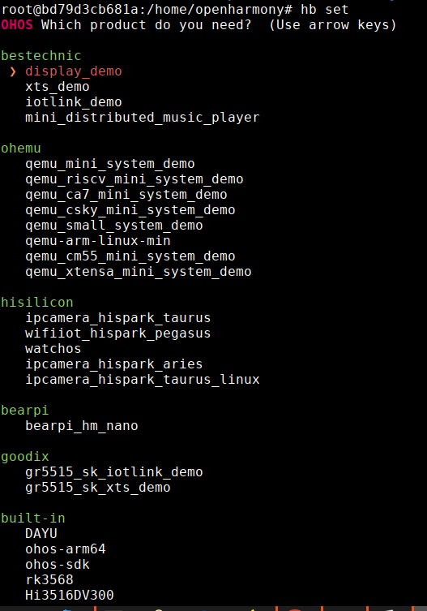

# 下载源码

https://gitee.com/openharmony/docs/blob/master/zh-cn/release-notes/Readme.md

建议选择3.1

# 编译运行

## 安装docker环境

https://gitee.com/openharmony/docs/blob/master/zh-cn/device-dev/get-code/gettools-acquire.md

官方提供了docker镜像，镜像包含openharmony的编译环境和基础的qemu，但是该镜像中包含的qemu是不完整的，为了使用riscv的qemu我们需要对该镜像进行改造，

### 原始镜像下载

1. 获取Docker镜像。

    ```
    docker pull swr.cn-south-1.myhuaweicloud.com/openharmony-docker/openharmony-docker:1.0.0
    ```

2. 进入源码根目录执行如下命令，从而进入Docker构建环境。 ubuntu下执行：

    ```
    docker run -it -v $(pwd):/home/openharmony swr.cn-south-1.myhuaweicloud.com/openharmony-docker/openharmony-docker:1.0.0
    ```

### 镜像改造

1. 安装网络工具

    ```
    apt install net-tools
    ```

2. 下载qemu源码包

    ```
    cd /home/tools
    wget https://download.qemu.org/qemu-7.1.0.tar.xz
    ```

3. 编译安装qemu

    ```
    tar -xvf qemu-7.1.0.tar.xz
    cd qemu-7.1.0
    mkdir build
    cd build
    ../configure
    make -j8
    make install
    ```

### 保存容器为镜像

```
docker commit [容器id]  镜像名称:镜像tag
```

### 导出docker镜像

```
docker save -o xxx.tar.xz  镜像名称:镜像tag
```

## 构建内核并运行

### hb set

openharmony 提供了一些示例供用户使用，

图中ohemu下的选项是可以用qemu运行的示例，其他均为硬件开发版使用的示例



但是，qemu中的示例也不是所有均可运行，这里只验证了qemu_small_system_demo，选择该选项

### hb env

输入该命令可以查看当前的系统环境参数

```bash
# hb env
[OHOS INFO] root path: /home/openharmony
[OHOS INFO] board: arm_virt
[OHOS INFO] kernel: liteos_a
[OHOS INFO] product: qemu_small_system_demo
[OHOS INFO] product path: /home/openharmony/vendor/ohemu/qemu_small_system_demo
[OHOS INFO] device path: /home/openharmony/device/qemu/arm_virt/liteos_a
[OHOS INFO] device company: qemu
```

### hb build -f

使用该命令可以构建kernel和qemu脚本

### 运行

```bash
# ./qemu-run
```

该脚本实际还会调用 vendor 目录下的 `qemu-run.sh`

定义在该脚本的27行

```bash
real_cmd="${product_path}/qemu_run.sh"
# 例如 vendor/ohemu/qemu_small_system_demo/qemu_run.sh
```

如果产生错误，则可以注释掉上述两个脚本的  `set -e`命令以查看具体的错误原因

```bash
# set -e
```

# gdb调试

这里我们选择liteos-m在riscv ISA下进行编译，默认已经进入了docker环境

首先需要配置-g编译选项

## 修改编译选项

```
cd device/qemu/riscv32_virt
vim liteos_m/config.gni
```

将 `board_opt_flags` 中的

```
board_opt_flags = []
```

编译选项修改为:

```
board_opt_flags = [ "-g" ]
```

保存并退出，

## 设置环境

在`hb set`时选择`qemu_riscv_mini_system_demo`

## 重新编译

在OHOS根目录重新编译:

```
hb build -f
```

在一个窗口（窗口A）中输入命令：

```
./qemu-run -g
```

在另一个窗口（窗口B）中输入命令：

```
riscv32-unknown-elf-gdb out/riscv32_virt/qemu_riscv_mini_system_demo/OHOS_Image
(gdb) target remote 172.17.0.5:1234   // 这里的ip是窗口A的IP
(gdb) b main
```


# 目录

## kernel

[1. liteos-m概述](./liteos-m-survey.md)

[2. liteos-m源码分析 - 内核初始化](./liteos-m-kernel-kernel-init.md)

[3. liteos-m源码分析 - task](./liteos-m-kernel-task.md)

[4. liteos-m源码分析 - memory](./liteos-m-kernel-memory.md)

[5.liteos-m源码分析 - schedule](./liteos-m-kernel-schedule.md)

[6.liteos-m源码分析 - timer](./liteos-m-kernel-timer.md)

[7.liteos-m源码分析 - queue](./liteos-m-kernel-queue.md)

[8.liteos-m源码分析 - interrupt](./liteos-m-kernel-interrupt.md)

[9.liteos-m源码分析 - mutex](./liteos-m-kernel-mutex.md)

[10.liteos-m源码分析 - 信号量](./liteos-m-kernel-sem.md)

[11.liteos-m源码分析 - event](./liteos-m-kernel-event.md)


## network

[1.liteos-m-network](./liteos-m-network.md)

## file system

[1.liteos-m-filesystem](./liteos-m-filesystem.md)

## 测试

[1.liteos-m-test](./liteos-m-test.md)