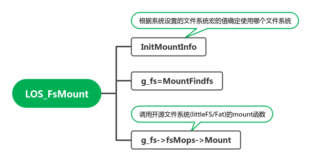

# 文件系统

> docs/zh-cn/device-dev/kernel/kernel-mini-extend-file.md

M核的文件系统子系统当前支持的文件系统有FATFS与LittleFS。同A核一样，通过VFS层提供了POSIX标准的操作，保持了接口的一致性，但是因为M核的资源非常紧张，VFS层非常轻薄，没有提供类似A核的高级功能（如pagecache等），主要是接口的标准化和适配工作，具体的事务由各个文件系统实际承载。M核文件系统支持的功能如下表所示：

**表1** 功能列表

| 功能分类 | 接口名   | 描述                                      | FATFS | LITTLEFS |
| -------- | -------- | ----------------------------------------- | ----- | -------- |
| 文件操作 | open     | 打开文件                                  | 支持  | 支持     |
|          | close    | 关闭文件                                  | 支持  | 支持     |
|          | read     | 读取文件内容                              | 支持  | 支持     |
|          | write    | 往文件写入内容                            | 支持  | 支持     |
|          | lseek    | 设置文件偏移位置                          | 支持  | 支持     |
|          | unlink   | 删除文件                                  | 支持  | 支持     |
|          | rename   | 重命名文件                                | 支持  | 支持     |
|          | fstat    | 通过文件句柄获取文件信息                  | 支持  | 支持     |
|          | stat     | 通过文件路径名获取文件信息                | 支持  | 支持     |
|          | fsync    | 文件内容刷入存储设备                      | 支持  | 支持     |
| 目录操作 | mkdir    | 创建目录                                  | 支持  | 支持     |
|          | opendir  | 打开目录                                  | 支持  | 支持     |
|          | readdir  | 读取目录项内容                            | 支持  | 支持     |
|          | closedir | 关闭目录                                  | 支持  | 支持     |
|          | rmdir    | 删除目录                                  | 支持  | 支持     |
| 分区操作 | mount    | 分区挂载                                  | 支持  | 支持     |
|          | umount   | 分区卸载                                  | 支持  | 支持     |
|          | umount2  | 分区卸载，可通过MNT_FORCE参数进行强制卸载 | 支持  | 不支持   |
|          | statfs   | 获取分区信息                              | 支持  | 不支持   |

- **[FAT](https://file+.vscode-resource.vscode-cdn.net/home/zcl/workspace/worktask/2023/4yue/liteos-A/code-v3.1-Release/OpenHarmony/docs/zh-cn/device-dev/kernel/kernel-mini-extend-file-fat.md)**
- **[LittleFS](https://file+.vscode-resource.vscode-cdn.net/home/zcl/workspace/worktask/2023/4yue/liteos-A/code-v3.1-Release/OpenHarmony/docs/zh-cn/device-dev/kernel/kernel-mini-extend-file-lit.md)**


## VFS层函数列表

`components/fs/vfs/los_fs.h`

```c
int LOS_Open(const char *path, int oflag, ...);

int LOS_Close(int fd);

ssize_t LOS_Read(int fd, void *buf, size_t nbyte);

ssize_t LOS_Write(int fd, const void *buf, size_t nbyte);

off_t LOS_Lseek(int fd, off_t offset, int whence);

int LOS_Unlink(const char *path);

int LOS_Fstat(int fd, struct stat *buf);

int LOS_Stat(const char *path, struct stat *buf);

int LOS_Fsync(int fd);

int LOS_Mkdir(const char *path, mode_t mode);

DIR *LOS_Opendir(const char *dirName);

struct dirent *LOS_Readdir(DIR *dir);

int LOS_Closedir(DIR *dir);

int LOS_Rmdir(const char *path);

int LOS_Rename(const char *oldName, const char *newName);

int LOS_Statfs(const char *path, struct statfs *buf);

int LOS_Ftruncate(int fd, off_t length);

int LOS_FsUmount2(const char *target, int flag);

int LOS_FsUmount(const char *target);

int LOS_FsMount(const char *source, const char *target,
          const char *filesystemtype, unsigned long mountflags,
          const void *data);

ssize_t LOS_Pread(int fd, void *buf, size_t nbyte, off_t offset);

ssize_t LOS_Pwrite(int fd, const void *buf, size_t nbyte, off_t offset);
```

上面说的==通过VFS层提供了POSIX标准的操作==，代码在`kal/libc/musl/fs.c`或`kal/libc/newlib/porting/src/fs.c`文件中，下面给出示例

```
int umount2(const char *target, int flag)
{
    return LOS_FsUmount2(target, flag);
}

int open(const char *path, int oflag, ...)
{
    va_list vaList;
    va_start(vaList, oflag);
    int ret;
    ret = LOS_Open(path, oflag, vaList);
    va_end(vaList);
    return ret;
}

int close(int fd)
{
    return LOS_Close(fd);
}
```

## VFS 初始化

VFS中提供了一个挂载函数`LOS_FsMount`，用于挂载文件系统

```c
int LOS_FsMount(const char *source, const char *target,
                const char *filesystemtype, unsigned long mountflags,
                const void *data)
{
    static int initFlag = 0;

    if (initFlag == 0) {
        InitMountInfo();
        initFlag = 1;
    }

    g_fs = MountFindfs(filesystemtype);
    if (g_fs == NULL) {
        errno = ENODEV;
        return FS_FAILURE;
    }

    if (g_fs->fsMops == NULL || g_fs->fsMops->Mount == NULL) {
        errno = ENOSYS;
        return FS_FAILURE;
    }

    return g_fs->fsMops->Mount(source, target, filesystemtype, mountflags, data);
}
```



```c
static void InitMountInfo(void)
{
#if (LOSCFG_SUPPORT_FATFS == 1)
    extern struct MountOps g_fatfsMnt;
    extern struct FileOps g_fatfsFops;
    g_fsmap[0].fileSystemtype = strdup("fat");
    g_fsmap[0].fsMops = &g_fatfsMnt;
    g_fsmap[0].fsFops = &g_fatfsFops;
#endif
#if (LOSCFG_SUPPORT_LITTLEFS == 1)
    extern struct MountOps g_lfsMnt;
    extern struct FileOps g_lfsFops;
    g_fsmap[1].fileSystemtype = strdup("littlefs");
    g_fsmap[1].fsMops = &g_lfsMnt;
    g_fsmap[1].fsFops = &g_lfsFops;
#endif
}

static struct FsMap *MountFindfs(const char *fileSystemtype)
{
    struct FsMap *m = NULL;

    for (int i = 0; i < MAX_FILESYSTEM_LEN; i++) {
        m = &(g_fsmap[i]);
        if (m->fileSystemtype && strcmp(fileSystemtype, m->fileSystemtype) == 0) {
            return m;
        }
    }

    return NULL;
}
```

在liteos-m中并没有使用文件系统的示例，在openharmony工程中可以找到文件系统的使用方式

# 文件系统使用方式

## 方式一

`device/qemu/SmartL_E802/liteos_m/board/fs/fs_init.c`

该文件定义了文件系统初始化方式,`FileSystemInit`创建了一个task，task会挂在littlefs文件系统，挂载完成之后即会退出该task

```c
static void FileSystemEntry(void)
{
    int ret = 0;
    struct lfs_config *littlefsConfig = LittlefsConfigGet();
    LittlefsDriverInit(0);
    SetDefaultMountPath(0, "/littlefs");
    ret = mount(NULL, "/littlefs", "littlefs", 0, littlefsConfig);
    if (ret != LOS_OK) {
        printf("Littlefs init failed 0x%x.\n", ret);
        return;
    }

    ret = mkdir("/littlefs", LITTLEFS_ROOTDIR_MODE);
    if (ret != LOS_OK) {
        printf("Mkdir failed 0x%x.\n", ret);
        return;
    }
    printf("Littlefs init successed!\n");
}


void FileSystemInit(void)
{
    int ret = 0;
    TSK_INIT_PARAM_S taskInitParam;

    ret = memset_s(&taskInitParam, sizeof(TSK_INIT_PARAM_S), 0, sizeof(TSK_INIT_PARAM_S));
    if (ret != EOK) {
        return;
    }

    taskInitParam.usTaskPrio = FS_INIT_TASK_PRIORITY;
    taskInitParam.pcName = "FileSystemTask";
    taskInitParam.pfnTaskEntry = (TSK_ENTRY_FUNC)FileSystemEntry;
    taskInitParam.uwStackSize = FS_INIT_TASK_SIZE;
    ret = LOS_TaskCreate(&g_taskId, &taskInitParam);
    if (ret != LOS_OK) {
        printf("Create filesystem init task failed.\n");
    }
}
```

## 方式二

`device/qemu/riscv32_virt/liteos_m/board/test/mount.c`

在`qemu_riscv_mini_system_demo`中提供了另一种文件系统的挂载方式，提供了一个shell命令用于挂载文件系统

```c
int OsShellCmdMount(int argc, const char **argv)
{
    int ret = 0;

    if (argc < 3) {
        PRINT_ERR("Usage: mount [DEVICE] [PATH] [FSTYPE]\n");
        return -1;
    }

    int strLen = strlen("/dev/cfiblk");
    if (strncmp(argv[0], "/dev/cfiblk", strLen)) {
        PRINT_ERR("mount can not found this device [%s], [/dev/cfiblk] support only now\n", argv[0]);
        return -1;
    }

    strLen = strlen(argv[2]);
    if ((strncmp(argv[2], "fat", strLen) && strncmp(argv[2], "FAT", strLen)) || strLen != strlen("fat"))  {
        PRINT_ERR("mount do not support this fstype [%s] now, try 'fat'\n", argv[2]);
        return -1;
    }

    if (ret = mount(argv[1], argv[1], argv[2], 0, NULL)) {
        PRINT_ERR("Mount error:%d\n", ret);
        return -1;
    }

    return 0;
}
```

注：

1. shell是一个task，检测键盘的输入，并解析命令
 	2. 根据官方提供的文档，未能成功在qemu中挂在fat文件系统，（目前只支持fat文件系统）


# 在riscv32 virt挂载fat

1. 准备FAT映像

~~~markdown
1. dd if=/dev/zero of=fat.img bs=32M count=1

## 使用losetup 挂载img到dev/loop设备上
1. 首先检查空闲设备
	sudo losetup -f
2. 挂载
	sudo losetup /dev/loop17 fat.img
3. 使用fdisk划分磁盘
	sudo fdisk /dev/loop17    # 磁盘分区选择MBR格式, FAT16或FAT32
	下面是fdisk命令：
		命令(输入 m 获取帮助)： n
        分区类型
           p   主分区 (2个主分区，0个扩展分区，2空闲)
           e   扩展分区 (逻辑分区容器)
        选择 (默认 p)： p
        分区号 (3,4, 默认  3): 
        第一个扇区 (34816-65535, 默认 34816): 
        Last sector, +/-sectors or +/-size{K,M,G,T,P} (34816-65535, 默认 65535): +8M

        创建了一个新分区 3，类型为“Linux”，大小为 8 MiB。
	
4. 取消挂载
	sudo losetup -d /dev/loop17
5. 挂载第一个分区
	```bash
	# 使用fdisk查看分区
	$ sudo fdisk -l fat.img
    Disk fat.img：32 MiB，33554432 字节，65536 个扇区
    单元：扇区 / 1 * 512 = 512 字节
    扇区大小(逻辑/物理)：512 字节 / 512 字节
    I/O 大小(最小/最佳)：512 字节 / 512 字节
    磁盘标签类型：dos
    磁盘标识符：0x00000000

    设备       启动  起点  末尾  扇区 大小 Id 类型
    fat.img1         2048 18431 16384   8M 83 Linux
    fat.img2        18432 34815 16384   8M 83 Linux
	```
	
	sudo losetup -o 1048576 /dev/loop1 fat.img    # 这里用第一个主分区示例
	// 1048576 = 2048 * 512
6. 格式化为fat格式
	sudo mkfs.vfat /dev/loop17
7. 取消挂载
	sudo losetup -d /dev/loop17
~~~

2. 在虚拟机中挂载

```
qemu-system-riscv32 ...(正常运行参数) \
                -drive if=pflash,file=fat.img,format=raw,index=1

OHOS # mount /dev/cfiblk /system fat  
```

**注意**：device必须指定index=1参数，在riscv32 virt中，挂载目录必须是以下4个目录之一：/system、/inner、/update、/user

 /system、/inner、/update、/user 分别对应分区1,2,3,4

# FAT

## 基本概念

FAT文件系统是File Allocation Table（文件配置表）的简称，主要包括DBR区、FAT区、DATA区三个区域。其中，FAT区各个表项记录存储设备中对应簇的信息，包括簇是否被使用、文件下一个簇的编号、是否文件结尾等。FAT文件系统有FAT12、FAT16、FAT32等多种格式，其中，12、16、32表示对应格式中FAT表项的比特数。FAT文件系统支持多种介质，特别在可移动存储介质（U盘、SD卡、移动硬盘等）上广泛使用，使嵌入式设备和Windows、Linux等桌面系统保持很好的兼容性，方便用户管理操作文件。

OpenHarmony内核支持FAT12、FAT16与FAT32三种格式的FAT文件系统，具有代码量小、资源占用小、可裁切、支持多种物理介质等特性，并且与Windows、Linux等系统保持兼容，支持多设备、多分区识别等功能。OpenHarmony内核支持硬盘多分区，可以在主分区以及逻辑分区上创建FAT文件系统。


## 开发指导


### 驱动适配

FAT文件系统的使用需要底层MMC相关驱动的支持。在一个带MMC存储设备的板子上运行FATFS，需要：

1、适配板端EMMC驱动，实现disk_status、disk_initialize、disk_read、disk_write、disk_ioctl接口；

2、新增fs_config.h文件，配置FS_MAX_SS（存储设备最大sector大小）、FF_VOLUME_STRS（分区名）等信息，例如：


```
#define FF_VOLUME_STRS     "system", "inner", "update", "user"
#define FS_MAX_SS          512
#define FAT_MAX_OPEN_FILES 50
```


### 开发流程

> **说明：**
>
> - FATFS文件与目录操作：
>     - 单个文件大小不超过4G。
>     - 支持同时打开的文件数最大为FAT_MAX_OPEN_FILES，文件夹数最大为FAT_MAX_OPEN_DIRS。
>     - 暂不支持根目录管理，文件/目录名均以分区名开头，例如“user/testfile”就是在“user”分区下名为“testfile”的文件或目录。
>     - 若需要同时多次打开同一文件，必须全部使用只读方式（O_RDONLY）。以可写方式（O_RDWR、O_WRONLY等）只能打开一次。
>     - 读写指针未分离，例如以O_APPEND（追加写）方式打开文件后，读指针也在文件尾，从头读文件前需要用户手动置位。
>     - 暂不支持文件与目录的权限管理。
>     - stat及fstat接口暂不支持查询修改时间、创建时间和最后访问时间。微软FAT协议不支持1980年以前的时间。
> - FATFS分区挂载与卸载：
>     - 支持以只读属性挂载分区。当mount函数的入参为MS_RDONLY时，所有的带有写入的接口，如write、mkdir、unlink，以及非O_RDONLY属性的open，将均被拒绝。
>     - mount支持通过MS_REMOUNT标记修改已挂载分区的权限。
>     - 在umount操作前，需确保所有目录及文件全部关闭。
>     - umount2支持通过MNT_FORCE参数强制关闭所有文件与文件夹并umount，但可能造成数据丢失，请谨慎使用。
> - FATFS支持重新划分存储设备分区、格式化分区，对应接口为fatfs_fdisk与fatfs_format：
>     - 在fatfs_format操作之前，若需要格式化的分区已挂载，需确保分区中的所有目录及文件全部关闭，并且分区umount。
>     - 在fatfs_fdisk操作前，需要该设备中的所有分区均已umount。
>     - fatfs_fdisk与fatfs_format会造成设备数据丢失，请谨慎使用。


## 编程实例


### 实例描述

本实例实现以下功能：

1. 创建目录“user/test”
2. 在“user/test”目录下创建文件“file.txt”
3. 在文件起始位置写入“Hello OpenHarmony!”
4. 将文件内容刷入设备中
5. 设置偏移到文件起始位置
6. 读取文件内容
7. 关闭文件
8. 删除文件
9. 删除目录


### 示例代码

前提条件：

- 系统已将MMC设备分区挂载到user目录

代码实现如下：


```c
#include <stdio.h>
#include <string.h>
#include "sys/stat.h"
#include "fcntl.h"
#include "unistd.h"

#define LOS_OK 0
#define LOS_NOK -1

int FatfsTest(void) 
{     
    int ret;
    int fd = -1;
    ssize_t len;
    off_t off;
    char dirName[20] = "user/test";
    char fileName[20] = "user/test/file.txt";
    char writeBuf[20] = "Hello OpenHarmony!";
    char readBuf[20] = {0};

    /* 创建目录“user/test” */
    ret = mkdir(dirName, 0777);
    if (ret != LOS_OK) {
        printf("mkdir failed.\n");
        return LOS_NOK;
    }

    /* 创建可读写文件"user/test/file.txt" */
    fd = open(fileName, O_RDWR | O_CREAT, 0777);
    if (fd < 0) {
        printf("open file failed.\n");
        return LOS_NOK;
    }

    /* 将writeBuf中的内容写入文件 */
    len = write(fd, writeBuf, strlen(writeBuf));
    if (len != strlen(writeBuf)) {
        printf("write file failed.\n");
        return LOS_NOK;
    }

    /* 将文件内容刷入存储设备中 */
    ret = fsync(fd);
    if (ret != LOS_OK) {
        printf("fsync failed.\n");
        return LOS_NOK;
    }

    /* 将读写指针偏移至文件头 */
    off = lseek(fd, 0, SEEK_SET);
    if (off != 0) {
        printf("lseek failed.\n");
        return LOS_NOK;
    }

    /* 将文件内容读出至readBuf中，读取长度为readBuf大小 */
    len = read(fd, readBuf, sizeof(readBuf));
    if (len != strlen(writeBuf)) {
        printf("read file failed.\n");
        return LOS_NOK;
    }
    printf("%s\n", readBuf);

    /* 关闭文件 */
    ret = close(fd);
    if (ret != LOS_OK) {
        printf("close failed.\n");
        return LOS_NOK;
    }

    /* 删除文件"user/test/file.txt" */
    ret = unlink(fileName);
    if (ret != LOS_OK) {
        printf("unlink failed.\n");
        return LOS_NOK;
    }

    /* 删除目录“user/test” */
    ret = rmdir(dirName);
    if (ret != LOS_OK) {
        printf("rmdir failed.\n");
        return LOS_NOK;
    }

    return LOS_OK;
}
```

# LittleFS

## 基本概念

LittleFS是一个小型的Flash文件系统，它结合日志结构（log-structured）文件系统和COW（copy-on-write）文件系统的思想，以日志结构存储元数据，以COW结构存储数据。这种特殊的存储方式，使LittleFS具有强大的掉电恢复能力（power-loss resilience)。分配COW数据块时LittleFS采用了名为统计损耗均衡的动态损耗均衡算法，使Flash设备的寿命得到有效保障。同时LittleFS针对资源紧缺的小型设备进行设计，具有极其有限的ROM和RAM占用，并且所有RAM的使用都通过一个可配置的固定大小缓冲区进行分配，不会随文件系统的扩大占据更多的系统资源。

当在一个资源非常紧缺的小型设备上，寻找一个具有掉电恢复能力并支持损耗均衡的Flash文件系统时，LittleFS是一个比较好的选择。


## 开发指导

移植LittleFS到新硬件设备上，需要申明lfs_config：


```c
const struct lfs_config cfg = {
    // block device operations
    .read  = user_provided_block_device_read,
    .prog  = user_provided_block_device_prog,
    .erase = user_provided_block_device_erase,
    .sync  = user_provided_block_device_sync,

    // block device configuration
    .read_size = 16,
    .prog_size = 16,
    .block_size = 4096,
    .block_count = 128,
    .cache_size = 16,
    .lookahead_size = 16,
    .block_cycles = 500,
};
```

其中.read，.prog，.erase，.sync分别对应该硬件平台上的底层的读写\擦除\同步等接口。

read_size 每次读取的字节数，可以比物理读单元大以改善性能，这个数值决定了读缓存的大小，但值太大会带来更多的内存消耗。

prog_size 每次写入的字节数，可以比物理写单元大以改善性能，这个数值决定了写缓存的大小，必须是read_size的整数倍，但值太大会带来更多的内存消耗。

block_size 每个擦除块的字节数，可以比物理擦除单元大，但此数值应尽可能小因为每个文件至少会占用一个块。必须是prog_size的整数倍。

block_count 可以被擦除的块数量，这取决于块设备的容量及擦除块的大小。


## 示例代码

代码实现如下：


```c
#include "lfs.h"
#include "stdio.h"
lfs_t lfs;
lfs_file_t file;
const struct lfs_config cfg = {
    // block device operations
    .read  = user_provided_block_device_read,
    .prog  = user_provided_block_device_prog,
    .erase = user_provided_block_device_erase,
    .sync  = user_provided_block_device_sync,
    // block device configuration
    .read_size = 16,
    .prog_size = 16,
    .block_size = 4096,
    .block_count = 128,
    .cache_size = 16,
    .lookahead_size = 16,
    .block_cycles = 500,
};
int main(void) {
    // mount the filesystem
    int err = lfs_mount(&lfs, &cfg);
    // reformat if we can't mount the filesystem
    // this should only happen on the first boot
    if (err) {
        lfs_format(&lfs, &cfg);
        lfs_mount(&lfs, &cfg);
    }
    // read current count
    uint32_t boot_count = 0;
    lfs_file_open(&lfs, &file, "boot_count", LFS_O_RDWR | LFS_O_CREAT);
    lfs_file_read(&lfs, &file, &boot_count, sizeof(boot_count));
    // update boot count
    boot_count += 1;
    lfs_file_rewind(&lfs, &file);
    lfs_file_write(&lfs, &file, &boot_count, sizeof(boot_count));
    // remember the storage is not updated until the file is closed successfully
    lfs_file_close(&lfs, &file);
    // release any resources we were using
    lfs_unmount(&lfs);
    // print the boot count
    printf("boot_count: %d\n", boot_count);
}
```

