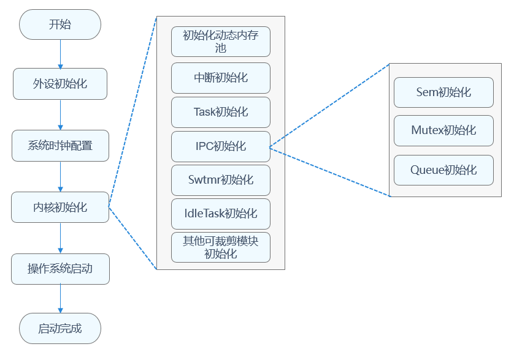

# 简介

LiteOS-M内核是面向IoT领域构建的轻量级物联网操作系统内核，具有小体积、低功耗、高性能的特点，其代码结构简单，主要包括内核最小功能集、内核抽象层、可选组件以及工程目录等，分为硬件相关层以及硬件无关层，硬件相关层提供统一的HAL（Hardware Abstraction Layer）接口，提升硬件易适配性，不同编译工具链和芯片架构的组合分类，满足AIoT类型丰富的硬件和编译工具链的拓展。其架构图如图1所示：


OpenHarmony LiteOS-M内核架构包含硬件相关层以及硬件无关层，如下图所示，其中硬件相关层按不同编译工具链、芯片架构分类，提供统一的HAL（Hardware Abstraction Layer）接口，提升了硬件易适配性，满足AIoT类型丰富的硬件和编译工具链的拓展；其他模块属于硬件无关层，其中基础内核模块提供基础能力，扩展模块提供网络、文件系统等组件能力，还提供错误处理、调测等能力，KAL（Kernel Abstraction Layer）模块提供统一的标准接口。

**图1** 内核架构图


# liteos-m 目录结构

```c
/kernel/liteos_m
├── arch                 # 内核指令架构层目录
│   ├── arm              # arm 架构代码
│   │   ├── arm9         # arm9 架构代码
│   │   ├── cortex-m3    # cortex-m3架构代码
│   │   ├── cortex-m33   # cortex-m33架构代码
│   │   ├── cortex-m4    # cortex-m4架构代码
│   │   ├── cortex-m7    # cortex-m7架构代码
│   │   └── include      # arm架构公共头文件目录
│   ├── csky             # csky架构代码
│   │   └── v2           # csky v2架构代码
│   ├── include          # 架构层对外接口存放目录
│   ├── risc-v           # risc-v 架构
│   │   ├── nuclei       # 芯来科技risc-v架构代码
│   │   └── riscv32      # risc-v官方通用架构代码
│   └── xtensa           # xtensa 架构代码
│       └── lx6          # xtensa lx6架构代码
├── components           # 可选组件
│   ├── backtrace        # 栈回溯功能
│   ├── cppsupport       # C++支持
│   ├── cpup             # CPUP功能
│   ├── dynlink          # 动态加载与链接
│   ├── exchook          # 异常钩子
│   ├── fs               # 文件系统
│   ├── lmk              # Low memory killer 机制
│   ├── lms              # Lite memory sanitizer 机制
│   ├── net              # Network功能
│   ├── power            # 低功耗管理
│   ├── shell            # shell功能
│   └── trace            # trace 工具
├── drivers              # 驱动框架Kconfig
├── kal                  # 内核抽象层
│   ├── cmsis            # cmsis标准接口支持
│   └── posix            # posix标准接口支持
├── kernel               # 内核最小功能集支持
│   ├── include          # 对外接口存放目录
│   └── src              # 内核最小功能集源码
├── targets              # 板级工程目录
├── testsuites           # 内核测试用例
├── tools                # 内核工具
├── utils                # 通用公共目录
```


## 内核启动流程

在开发板配置文件target_config.h配置系统时钟、每秒Tick数，可以对任务、内存、IPC、异常处理模块进行裁剪配置。系统启动时，根据配置进行指定模块的初始化。内核启动流程包含外设初始化、系统时钟配置、内核初始化、操作系统启动等，详见内核启动流程。

**图2** 内核启动流程



# main.c

一般来讲，内核的入口函数定义在`main.c`文件中，linux内核启动函数为`start_kernel`文件位置为`linux/init/mian.c`；liteos-a内核启动函数为`main()`定义在`kernel\common\main.c`；

liteos-m内核启动函数并没有定义在通用的文件中，而是需要用户根据板子的不同自行定义，例如在targets目录下给了两个例子：


下面将两个`main.c`文件进行对比，左边是`riscv_nuclei_demo_soc_gcc`的，


观察发现他们相同的部分是`RunTaskSample()`函数，函数定义如下：

```c
// targets/riscv_nuclei_demo_soc_gcc/Src/task_sample.c
VOID RunTaskSample(VOID)
{
    UINT32 ret;
    ret = LOS_KernelInit();
    if (ret == LOS_OK) {
        TaskSample();
        LOS_Start();
    }
}
```

该函数首先调用`LOS_KernelInit`完成内核初始化，如果初始化成功则调用`TaskSample`创建两个任务sample，接下来调用`LOS_Start`启动内核(开启任务调度)。

## 谁调用了main.c

以openharmony工程中的qemu riscv为例

`device/qemu/riscv32_virt/liteos_m/board/los_start.S`是内核的入口文件，内核从`_start`开始执行

```c
.extern memset
.global _start
.section .start.text
.align 4
_start:
    li    t0, RISCV_MSTATUS_MPP # 0x00001800, 即MPP = 0x11 机器模式
    csrw  mstatus, t0           # msatuts = 0x00001800, 机器模式
    csrw  mie, zero             # mie = 0, 禁止中断
    la    t0, HalTrapVector     # t0 = HalTrapVector
    csrw  mtvec, t0      # direct mode, Machine trap-handler base address.

    .option push
    .option norelax
    la    gp, __global_pointer$  # gp = 0x8007ee40
    .option pop

    la    t0, __bss_start
    la    t1, __bss_end
2:
    sw    zero, 0x0(t0)
    addi  t0, t0, 0x4
    bgtu  t1, t0, 2b            # 如果t1 >= t0，跳转到 2b

    la    sp, __start_and_irq_stack_top  # sp = 0x8008cf00

    tail  main    # 尾调用，return(main())
```


# LOS_KernelInit


```c

```

# LOS_Start


```c
// kernel/src/los_init.c

LITE_OS_SEC_TEXT_INIT UINT32 LOS_Start(VOID)
{
    return ArchStartSchedule();
}
```

通过其调用的`ArchStartSchedule`函数名不难看出，该函数是与体系架构密切相关的，根据体系架构的不同，会调用不同的函数。该函数定义在如下图所示不同体系架构的`los_context.c`文件中


但是，我查看了所有目录下的实现，他们的实现均是相同的：

```c
// arch/risc-v/riscv32/gcc/los_context.c

LITE_OS_SEC_TEXT_INIT UINT32 ArchStartSchedule(VOID)
{
    (VOID)LOS_IntLock();
    OsSchedStart();
    HalStartToRun();
    return LOS_OK; /* never return */
}
```

## OsSchedStart

调用的`OsSchedStart`也是相同的:

```c
// kernel/src/los_sched.c  493

VOID OsSchedStart(VOID)
{
    PRINTK("Entering scheduler\n");

    (VOID)LOS_IntLock();
    LosTaskCB *newTask = OsGetTopTask();

    newTask->taskStatus |= OS_TASK_STATUS_RUNNING;
    g_losTask.newTask = newTask;
    g_losTask.runTask = g_losTask.newTask;

    newTask->startTime = OsGetCurrSchedTimeCycle();
    OsSchedTaskDeQueue(newTask);

    OsTickSysTimerStartTimeSet(newTask->startTime);

    OsSwtmrResponseTimeReset(newTask->startTime);

    /* Initialize the schedule timeline and enable scheduling */
    g_taskScheduled = TRUE;

    g_schedResponseTime = OS_SCHED_MAX_RESPONSE_TIME;
    g_schedResponseID = OS_INVALID;
    OsSchedSetNextExpireTime(newTask->taskID, newTask->startTime + newTask->timeSlice);
}
```

## HalStartToRun

如此看，liteos-m的实现方式与单线程版的协程类似，全局只有一个线程，任务在栈中保存其寄存器的值，并依靠主动的上下文切换对任务进行切换

```c
/**
* typedef struct {
*      LosTaskCB   *runTask;
*      LosTaskCB   *newTask;
*   } LosTask;
*/

HalStartToRun:
    la   a1, g_losTask
    lw   a0, 4(a1)    // a0 = g_losTask.newTask

// retireve stack pointer
    lw      sp, TASK_CB_KERNEL_SP(a0)  // sp 指针指向 a0 的上下文记录的sp

// enable global interrupts
    lw      t0, 16 * REGBYTES(sp)
    csrw    mstatus, t0

// retrieve the address at which exception happened
    lw      t0, 17 * REGBYTES(sp)
    csrw    mepc, t0

// retrieve the registers
    POP_ALL_REG   // 从栈中恢复寄存器的值

    mret
```

