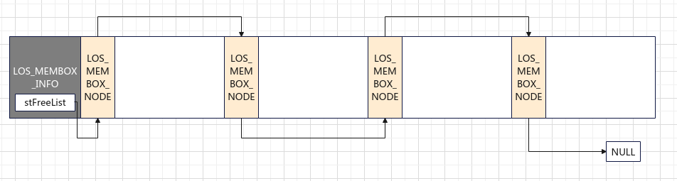
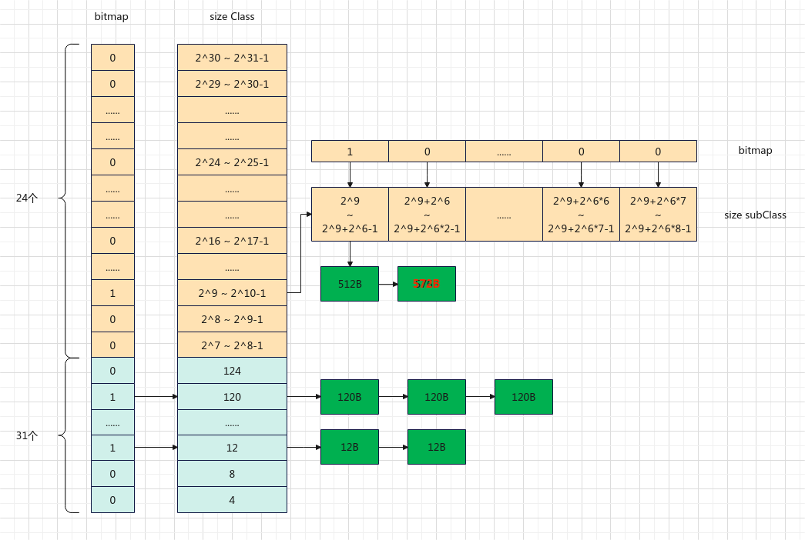
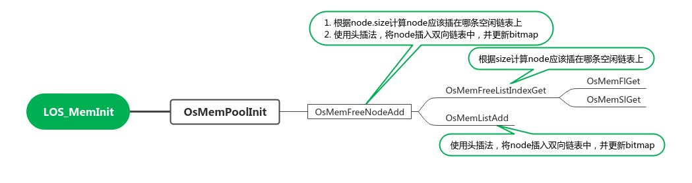
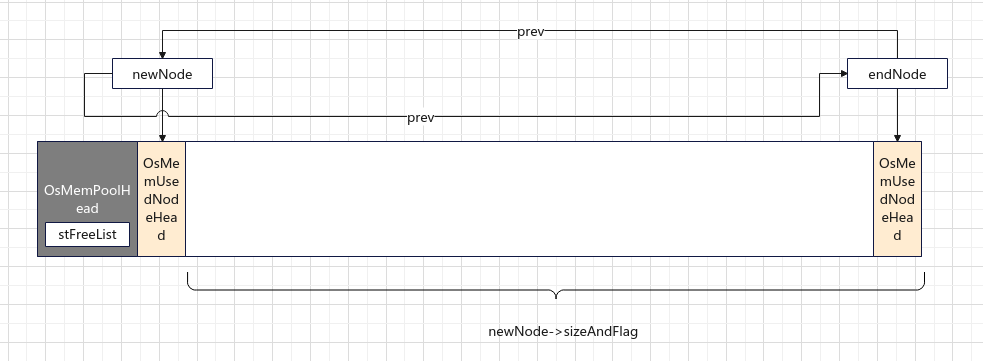
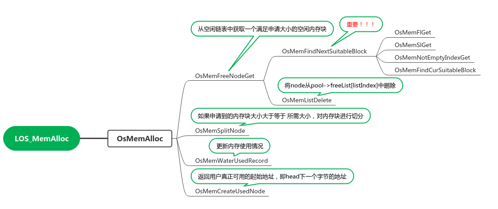
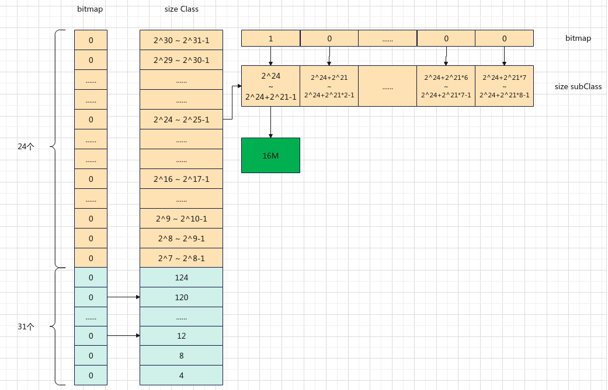

# 简介

liteos-m的内存管理分为静态内存管理和动态内存管理，提供初始化、内存分配、内存释放等功能

1. 动态内存：在动态内存池中分配指定大小的内存块
    - 优点：按需分配
    - 缺点：可能出现内存碎片
2. 静态内存：在静态内存池中分配用户初始化时预设（固定）大小的内存快
    - 优点：分配和释放效率高，无碎片
    - 缺点：只能申请固定大小的内存块，不能按需申请


# 静态内存-Membox

kernel/src/mm/los_membox.c

## 初始化

```c
/**
 * @brief 静态内存初始化
 * 
 * @param pool      内存池起始地址
 * @param poolSize  内存池大小
 * @param blkSize   内存块大小
 * @return UINT32 
 */
UINT32 LOS_MemboxInit(VOID *pool, UINT32 poolSize, UINT32 blkSize)
{
    LOS_MEMBOX_INFO *boxInfo = (LOS_MEMBOX_INFO *)pool;
    LOS_MEMBOX_NODE *node = NULL;
    UINT32 index;
    UINT32 intSave;

    if (pool == NULL) {
        return LOS_NOK;
    }

    if (blkSize == 0) {
        return LOS_NOK;
    }

    if (poolSize < sizeof(LOS_MEMBOX_INFO)) {
        return LOS_NOK;
    }

    MEMBOX_LOCK(intSave);
    // 内存块大小为 blkSize + LOS_MEMBOX_NODE结构体大小
    boxInfo->uwBlkSize = LOS_MEMBOX_ALIGNED(blkSize + OS_MEMBOX_NODE_HEAD_SIZE);
    // 计算内存块个数
    boxInfo->uwBlkNum = (poolSize - sizeof(LOS_MEMBOX_INFO)) / boxInfo->uwBlkSize;
    boxInfo->uwBlkCnt = 0;
    if (boxInfo->uwBlkNum == 0) {
        MEMBOX_UNLOCK(intSave);
        return LOS_NOK;
    }

    // 获取第一个内存块
    node = (LOS_MEMBOX_NODE *)(boxInfo + 1);

    boxInfo->stFreeList.pstNext = node;

    // 使用单链表串联起来
    for (index = 0; index < boxInfo->uwBlkNum - 1; ++index) {
        node->pstNext = OS_MEMBOX_NEXT(node, boxInfo->uwBlkSize);
        node = node->pstNext;
    }

    // 最后一个内存块
    node->pstNext = NULL;

#if (LOSCFG_PLATFORM_EXC == 1)
    OsMemBoxAdd(pool);
#endif

    MEMBOX_UNLOCK(intSave);

    return LOS_OK;
}
```



初始化会对传入的pool进行初始化，

1. 内存池的头部存放一个`LOS_MEMBOX_INFO`对象，其中`stFreeList`记录未被使用的内存块
2. 每一个内存块由`LOS_MEMBOX_NODE`和实际内存区域组成，`LOS_MEMBOX_NODE`存放一个next指针，通过该指针串联起来，并由`stFreeList`进行管理。

## 内存申请

```c
VOID *LOS_MemboxAlloc(VOID *pool)
{
    LOS_MEMBOX_INFO *boxInfo = (LOS_MEMBOX_INFO *)pool;
    LOS_MEMBOX_NODE *node = NULL;
    LOS_MEMBOX_NODE *nodeTmp = NULL;
    UINT32 intSave;

    if (pool == NULL) {
        return NULL;
    }

    MEMBOX_LOCK(intSave);
    node = &(boxInfo->stFreeList);
    if (node->pstNext != NULL) {
        // 获取下一个可用的内存块
        nodeTmp = node->pstNext;
        node->pstNext = nodeTmp->pstNext;
        // 设置node->pstNext指向一个magic数，magic数低8位存储taskID
        OsMemBoxSetMagic(nodeTmp);
        boxInfo->uwBlkCnt++;
    }
    MEMBOX_UNLOCK(intSave);

    // OS_MEMBOX_USER_ADDR(nodeTmp) 获取实际可用的内存块起始地址，即越过LOS_MEMBOX_NODE
    return (nodeTmp == NULL) ? NULL : OS_MEMBOX_USER_ADDR(nodeTmp);
}
```

## 内存释放

```c
UINT32 LOS_MemboxFree(VOID *pool, VOID *box)
{
    LOS_MEMBOX_INFO *boxInfo = (LOS_MEMBOX_INFO *)pool;
    UINT32 ret = LOS_NOK;
    UINT32 intSave;

    if ((pool == NULL) || (box == NULL)) {
        return LOS_NOK;
    }

    MEMBOX_LOCK(intSave);
    do {
        LOS_MEMBOX_NODE *node = OS_MEMBOX_NODE_ADDR(box);
        if (OsCheckBoxMem(boxInfo, node) != LOS_OK) {
            break;
        }
        // 头插法
        node->pstNext = boxInfo->stFreeList.pstNext;
        boxInfo->stFreeList.pstNext = node;
        boxInfo->uwBlkCnt--;
        ret = LOS_OK;
    } while (0);
    MEMBOX_UNLOCK(intSave);

    return ret;
}
```

# 动态内存

kernel/src/mm/los_memory.c

动态内存根据空闲内存块的大小，使用多个空闲链表进行管理。根据内存块大小分为两个部分：[4-127]和$[2^7 : 2^{31}]$

- 对[4-127]区间的内存进行等分，分为31个小区间，每个小区间对应内存块大小为4字节的倍数。每个小区间对应一个空闲链表和用于标记对应空闲内存链表是否为空的一个比特值。[4:127]区间的内存使用一个32位无符号整数位图标记。
- 大于127字节的空闲内存块，按照2的次幂区间大小进行空闲链表管理。总共分为24个小区间（size Class），每个小区间又等分为8个二级区间（size subclass）。每个二级区间对应一个空闲链表和用于标记对应空闲内存链表是否为空的一个比特值。总共24*8=192个二级区间，对应192个空闲链表和192、32=6个32位无符号整数位图标记。

综上所述，管理动态内存共需192 + 31 = 223个空闲链表和7个32位无符号整数位图标记。




## 初始化

`LOS_MemInit`对传入的参数进行校验，随后调用`OsMemPoolInit`对内存池进行实际的初始化

```c
UINT32 LOS_MemInit(VOID *pool, UINT32 size)
{
    // size 需要大于最小值
    if ((pool == NULL) || (size <= OS_MEM_MIN_POOL_SIZE)) {
        return LOS_NOK;
    }

    // 起始地没有按4字节对齐 或 size没有按4字节对齐
    if (((UINTPTR)pool & (OS_MEM_ALIGN_SIZE - 1)) || \
        (size & (OS_MEM_ALIGN_SIZE - 1))) {
        PRINT_ERR("LiteOS heap memory address or size configured not aligned:address:0x%x,size:0x%x, alignsize:%d\n", \
                  (UINTPTR)pool, size, OS_MEM_ALIGN_SIZE);
        return LOS_NOK;
    }

    if (OsMemPoolInit(pool, size)) {
        return LOS_NOK;
    }

#if (LOSCFG_MEM_MUL_POOL == 1)
    if (OsMemPoolAdd(pool, size)) {
        (VOID)OsMemPoolDeinit(pool);
        return LOS_NOK;
    }
#endif

    OsHookCall(LOS_HOOK_TYPE_MEM_INIT, pool, size);

    return LOS_OK;
}
```


### OsMemPoolInit



```c
struct OsMemPoolHead {
    struct OsMemPoolInfo info;
    UINT32 freeListBitmap[OS_MEM_BITMAP_WORDS]; // (((31 + (24 << 3)) >> 5) + 1) = 7，每一位表示一条链表
    struct OsMemFreeNodeHead *freeList[OS_MEM_FREE_LIST_COUNT]; // (31 + (24 << 3)) = 223
#if (LOSCFG_MEM_MUL_POOL == 1)
    VOID *nextPool;
#endif
};

STATIC UINT32 OsMemPoolInit(VOID *pool, UINT32 size)
{
    struct OsMemPoolHead *poolHead = (struct OsMemPoolHead *)pool;
    struct OsMemNodeHead *newNode = NULL;
    struct OsMemNodeHead *endNode = NULL;
#ifdef LOSCFG_KERNEL_LMS
    UINT32 resize = 0;
    if (g_lms != NULL) {
        /*
         * resize == 0, shadow memory init failed, no shadow memory for this pool, set poolSize as original size.
         * resize != 0, shadow memory init successful, set poolSize as resize.
         */
        resize = g_lms->init(pool, size);
        size = (resize == 0) ? size : resize;
    }
#endif
    (VOID)memset(poolHead, 0, sizeof(struct OsMemPoolHead));

    poolHead->info.pool = pool;
    poolHead->info.totalSize = size;
    /* default attr: lock, not expand. 属性：锁定，不可扩展*/
    poolHead->info.attr &= ~(OS_MEM_POOL_UNLOCK_ENABLE | OS_MEM_POOL_EXPAND_ENABLE);

    newNode = OS_MEM_FIRST_NODE(pool);  // OsMemPoolHead 后面的位置
    // size - 内存池头大小 - 块头大小,即剩余的全部空间
    newNode->sizeAndFlag = (size - sizeof(struct OsMemPoolHead) - OS_MEM_NODE_HEAD_SIZE);
    // 设置prev指向内存池的最后一个节点
    newNode->ptr.prev = OS_MEM_END_NODE(pool, size);
    OS_MEM_SET_MAGIC(newNode);
    // 1. 根据node.size计算node应该插在哪条空闲链表上
    // 2. 使用头插法，将node插入双向链表中，并更新bitmap
    OsMemFreeNodeAdd(pool, (struct OsMemFreeNodeHead *)newNode);

    /* The last mem node */
    endNode = OS_MEM_END_NODE(pool, size);
    OS_MEM_SET_MAGIC(endNode);
#if OS_MEM_EXPAND_ENABLE
    endNode->ptr.next = NULL;
    OsMemSentinelNodeSet(endNode, NULL, 0);
#else
    endNode->sizeAndFlag = 0;
    endNode->ptr.prev = newNode;
    OS_MEM_NODE_SET_USED_FLAG(endNode->sizeAndFlag);
#endif
#if (LOSCFG_MEM_WATERLINE == 1)
    // 当前使用的空间大小 = 内存池头大小 + 块头大小
    poolHead->info.curUsedSize = sizeof(struct OsMemPoolHead) + OS_MEM_NODE_HEAD_SIZE;
    // 水线，当前内存使用情况
    poolHead->info.waterLine = poolHead->info.curUsedSize;
#endif

#ifdef LOSCFG_KERNEL_LMS
    if (resize != 0) {
        OsLmsFirstNodeMark(pool, newNode);
    }
#endif
    return LOS_OK;
}
```



**index计算**

```c
STATIC INLINE UINT32 OsMemFreeListIndexGet(UINT32 size)
{
    UINT32 fl = OsMemFlGet(size);
    if (fl < OS_MEM_SMALL_BUCKET_COUNT) {
        return fl;
    }

    UINT32 sl = OsMemSlGet(size, fl);
    return (OS_MEM_SMALL_BUCKET_COUNT + ((fl - OS_MEM_SMALL_BUCKET_COUNT) << OS_MEM_SLI) + sl);
}
```

$$
\begin{equation}
fl = 
\begin{cases}
size / 4 - 1 & size < 128; \\
\log_2 size - 7 + 31 
\end{cases} 
\end{equation}
$$

$$
\begin{equation}
sl = 
\begin{cases}
0 & fl < 31 或 size < 128 \\
(size * 8) /2^{\log_2 size} - 8
\end{cases} 
\end{equation}
\\
$$

$$
\begin{equation}
index = 
\begin{cases}
fl & fl < 31 \\
31 + (fl-31) * 8 + sl
\end{cases} 
\end{equation}
$$

## 内存申请



### LOS_MemAlloc

```c
VOID *LOS_MemAlloc(VOID *pool, UINT32 size)
{
    if ((pool == NULL) || (size == 0)) {
        return NULL;
    }

    // 申请内存最小值为8
    if (size < OS_MEM_MIN_ALLOC_SIZE) {
        size = OS_MEM_MIN_ALLOC_SIZE;
    }

    struct OsMemPoolHead *poolHead = (struct OsMemPoolHead *)pool;
    VOID *ptr = NULL;
    UINT32 intSave = 0;

    MEM_LOCK(poolHead, intSave);
    do {
        // 是否标记为使用或内存对齐
        if (OS_MEM_NODE_GET_USED_FLAG(size) || OS_MEM_NODE_GET_ALIGNED_FLAG(size)) {
            break;
        }
        ptr = OsMemAlloc(poolHead, size, intSave);
    } while (0);
    MEM_UNLOCK(poolHead, intSave);

    OsHookCall(LOS_HOOK_TYPE_MEM_ALLOC, pool, ptr, size);

    return ptr;
}
```

### OsMemAlloc

```c
STATIC INLINE VOID *OsMemAlloc(struct OsMemPoolHead *pool, UINT32 size, UINT32 intSave)
{
    struct OsMemNodeHead *allocNode = NULL;

#if (LOSCFG_BASE_MEM_NODE_INTEGRITY_CHECK == 1)
    if (OsMemAllocCheck(pool, intSave) == LOS_NOK) {
        return NULL;
    }
#endif

    // 申请的内存大小需要加上头结点的大小，并以4字节对齐
    UINT32 allocSize = OS_MEM_ALIGN(size + OS_MEM_NODE_HEAD_SIZE, OS_MEM_ALIGN_SIZE);
#if OS_MEM_EXPAND_ENABLE || (LOSCFG_KERNEL_LMK == 1)
retry:
#endif
    // 从空闲链表中获取一个满足申请大小的空闲内存块
    allocNode = OsMemFreeNodeGet(pool, allocSize);
    // 如果申请失败，打印错误信息
    if (allocNode == NULL) {
#if OS_MEM_EXPAND_ENABLE
        if (pool->info.attr & OS_MEM_POOL_EXPAND_ENABLE) {
            INT32 ret = OsMemPoolExpand(pool, allocSize, intSave);
            if (ret == 0) {
                goto retry;
            }
        }
#endif

#if (LOSCFG_KERNEL_LMK == 1)
        UINT32 killRet = LOS_LmkTasksKill();
        if (killRet == LOS_OK) {
            goto retry;
        }
#endif
        PRINT_ERR("---------------------------------------------------"
                  "--------------------------------------------------------\n");
        MEM_UNLOCK(pool, intSave);
        OsMemInfoPrint(pool);
        MEM_LOCK(pool, intSave);
        PRINT_ERR("[%s] No suitable free block, require free node size: 0x%x\n", __FUNCTION__, allocSize);
        PRINT_ERR("----------------------------------------------------"
                  "-------------------------------------------------------\n");
        return NULL;
    }

    // 如果申请到的内存块大小大于等于 所需大小，对内存块进行切分
    if ((allocSize + OS_MEM_MIN_LEFT_SIZE) <= allocNode->sizeAndFlag) {
        OsMemSplitNode(pool, allocNode, allocSize);
    }

    // 设置被使用flag
    OS_MEM_NODE_SET_USED_FLAG(allocNode->sizeAndFlag);
    // 更新内存使用情况
    OsMemWaterUsedRecord(pool, OS_MEM_NODE_GET_SIZE(allocNode->sizeAndFlag));

#if (LOSCFG_MEM_LEAKCHECK == 1)
    OsMemLinkRegisterRecord(allocNode);
#endif
    // 返回用户真正可用的起始地址，即head下一个字节的地址
    return OsMemCreateUsedNode((VOID *)allocNode);
}
```

该函数中调用了两个重要的函数：

- `OsMemFreeNodeGet`： 从空闲链表中获取一个满足申请大小的空闲内存块
- `OsMemSplitNode`：对allocNode进行切分，剩余的部分称为newFreeNode， 之后对newFreeNode下一块内存进行检查，如果下一块内存未被使用，则与newFreeNode进行组合形成一块新内存 将newFreeNode插入空闲链表进行管理

### OsMemFreeNodeGet

```c
STATIC INLINE struct OsMemNodeHead *OsMemFreeNodeGet(VOID *pool, UINT32 size)
{
    struct OsMemPoolHead *poolHead = (struct OsMemPoolHead *)pool;
    UINT32 index;
    // 获取一个满足要求的块
    struct OsMemFreeNodeHead *firstNode = OsMemFindNextSuitableBlock(pool, size, &index);
    if (firstNode == NULL) {
        return NULL;
    }

    // 将node从pool->freeList[listIndex]中删除
    OsMemListDelete(poolHead, index, firstNode);

    return &firstNode->header;
}
```

#### OsMemFindNextSuitableBlock - 找到可用的内存块

```c
/**
 * @brief 根据size计算一级index(fl)和二级index(sl)，并计算最终的 curIndex
 *        调用OsMemNotEmptyIndexGet从 index 对应的级别取一个内存块，成功则返回
 *        检查一级区间，查看更大量级（curIndex 对应的下一个级别）内存块的 bitmap ，如果 bitmap 不为0，则返回该 index
 *        若上述均失败：
 *          遍历当前量级（curIndex）对应的链表，直到找到一个大于所需空间的内存块
 *        
 * 
 * @param pool 
 * @param size 
 * @param outIndex 
 * @return struct OsMemFreeNodeHead * 
 */
STATIC INLINE struct OsMemFreeNodeHead *OsMemFindNextSuitableBlock(VOID *pool, UINT32 size, UINT32 *outIndex)
{
    struct OsMemPoolHead *poolHead = (struct OsMemPoolHead *)pool;
    UINT32 fl = OsMemFlGet(size);
    UINT32 sl;
    UINT32 index, tmp;
    UINT32 curIndex = OS_MEM_FREE_LIST_COUNT;
    UINT32 mask;

    do {
        if (fl < OS_MEM_SMALL_BUCKET_COUNT) {
            index = fl;
        } else {
            sl = OsMemSlGet(size, fl);
            curIndex = ((fl - OS_MEM_SMALL_BUCKET_COUNT) << OS_MEM_SLI) + sl + OS_MEM_SMALL_BUCKET_COUNT;
            // 优先从更大的块中查找，这样直接取链表的第一个元素即可
            index = curIndex + 1;
        }
        
        // 从二级区间进行查找
        tmp = OsMemNotEmptyIndexGet(poolHead, index);
        // 如果找到合适的元素
        if (tmp != OS_MEM_FREE_LIST_COUNT) {
            index = tmp;
            goto DONE;
        }

        // 优先从更大的块（粒度是一级区间）中查找，这样直接取链表的第一个元素即可
        // 遍历bitmap，mask不为0,则找到对应的链表
        for (index = LOS_Align(index + 1, 32); index < OS_MEM_FREE_LIST_COUNT; index += 32) {
            /* 5: Divide by 32 to calculate the index of the bitmap array. */
            mask = poolHead->freeListBitmap[index >> 5];
            if (mask != 0) {
                index = OsMemFFS(mask) + index;
                goto DONE;
            }
        }
    } while (0);

    if (curIndex == OS_MEM_FREE_LIST_COUNT) {
        return NULL;
    }

    *outIndex = curIndex;
    // 遍历index链表所有元素直到找到一个大于要申请内存大小的块
    return OsMemFindCurSuitableBlock(poolHead, curIndex, size);
DONE:
    *outIndex = index;
    return poolHead->freeList[index];
}
```


```c
// 从二级区间进行查找
STATIC INLINE UINT32 OsMemNotEmptyIndexGet(struct OsMemPoolHead *poolHead, UINT32 index)
{
    /* 5: Divide by 32 to calculate the index of the bitmap array. */
    // 取出index对应的mask
    UINT32 mask = poolHead->freeListBitmap[index >> 5];
    // index & OS_MEM_BITMAP_MASK 为了计算index相对31偏移的位置
    // 1 << n 位，是为了计算index对应的mask位
    // -1 ，index对应的位置0,小于index的位置置1
    // 取反，大于等于index的对应的位置值1，其他为0
    mask &= ~((1 << (index & OS_MEM_BITMAP_MASK)) - 1);
    // mask > 0表示，有大于等于index的内存块的链表不为空
    if (mask != 0) {
        // index & ~OS_MEM_BITMAP_MASK 相当于 32 * n
        // 找到对应的index
        index = OsMemFFS(mask) + (index & ~OS_MEM_BITMAP_MASK);
        return index;
    }

    return OS_MEM_FREE_LIST_COUNT;
}

// 假设index = 40, mask = 0x0000 0100
1. mask = poolHead->freeListBitmap[1]
2. mask &= ~((1 <<(40 & 31)) - 1)  ---> mask &= ~((1 << 8) - 1) 
    ---> mask &= 0xFFFF FF00 ---> mask = 0x0000 0100
3. index = 8 + 32 = 40
```


假设内存初始化完成后有一个16M大小的内存，分别观察下面两个例子（均只考虑首次申请的情况）:

1. 申请一块大小为16字节的内存
2. 申请一块大小为256字节的内存

那么在初始化完成后，有如下分布：



==**注意：**第一个存储8以下大小的内存块，第二个存储8-11大小的内存块==

##### 申请一块大小为16字节的内存

1. 计算fl和index

    fl = 16 / 4 - 1 = 3

    index = fl = 3

2. 进入 `OsMemNotEmptyIndexGet`函数

    bitmap = poolHead->freeListBitmap[0]

    bitmap == 0,因此返回OS_MEM_FREE_LIST_COUNT

3. 检查大于128的块优先从更大的块（粒度是一级区间）中查找，这样直接取链表的第一个元素即可，遍历bitmap，mask不为0,则找到对应的链表

    ​	遍历从poolHead->freeListBitmap[1]到poolHead->freeListBitmap[6]，最终会找到16M的内存块


##### 申请一块大小为256字节的内存

1. 计算fl和index

    fl = $log_2 256 - 7 + 31$ = 32

    sl = $(size * 8) /2^{\log_2 size} - 8$ = 0

    cruIndex = $(fl - 31) * 8 + sl + 31$ = 39

    index = cruIndex + 1 = 40

2. 进入 `OsMemNotEmptyIndexGet`函数

    bitmap = poolHead->freeListBitmap[1]

    bitmap==0，因此返回OS_MEM_FREE_LIST_COUNT

3. 检查大于128的块优先从更大的块（粒度是一级区间）中查找，这样直接取链表的第一个元素即可，遍历bitmap，mask不为0,则找到对应的链表

    ​	遍历从poolHead->freeListBitmap[2]到poolHead->freeListBitmap[6]，最终会找到16M的内存块

### OsMemSplitNode

```c
STATIC INLINE VOID OsMemSplitNode(VOID *pool, struct OsMemNodeHead *allocNode, UINT32 allocSize)
{
    struct OsMemFreeNodeHead *newFreeNode = NULL;
    struct OsMemNodeHead *nextNode = NULL;

    // newFreeNode 起始地址，在后半部分
    newFreeNode = (struct OsMemFreeNodeHead *)(VOID *)((UINT8 *)allocNode + allocSize);
    newFreeNode->header.ptr.prev = allocNode;
    newFreeNode->header.sizeAndFlag = allocNode->sizeAndFlag - allocSize;
    allocNode->sizeAndFlag = allocSize;
    // newFreeNode 结束地址的下一个字节
    nextNode = OS_MEM_NEXT_NODE(&newFreeNode->header);
    if (!OS_MEM_NODE_GET_LAST_FLAG(nextNode->sizeAndFlag) && !OS_MEM_IS_GAP_NODE(nextNode)) {
        nextNode->ptr.prev = &newFreeNode->header;

        // 如果下一块内存没有被使用，则将下一块内存从pool->freeList[listIndex]中删除，
        // 并和newFreeNode组合成一块新的内存,用newFreeNode进行标识
        if (!OS_MEM_NODE_GET_USED_FLAG(nextNode->sizeAndFlag)) {
            OsMemFreeNodeDelete(pool, (struct OsMemFreeNodeHead *)nextNode);
            OsMemMergeNode(nextNode);
        }
    }

    // 把newFreeNode插入链表
    OsMemFreeNodeAdd(pool, newFreeNode);
}
```


## 内存释放

```c
UINT32 LOS_MemFree(VOID *pool, VOID *ptr)
{
    if ((pool == NULL) || (ptr == NULL) || !OS_MEM_IS_ALIGNED(pool, sizeof(VOID *)) ||
        !OS_MEM_IS_ALIGNED(ptr, sizeof(VOID *))) {
        return LOS_NOK;
    }

    OsHookCall(LOS_HOOK_TYPE_MEM_FREE, pool, ptr);

    UINT32 ret = LOS_NOK;
    struct OsMemPoolHead *poolHead = (struct OsMemPoolHead *)pool;
    struct OsMemNodeHead *node = NULL;
    UINT32 intSave = 0;

    MEM_LOCK(poolHead, intSave);
    do {
        // 获取校准内存对齐后的真实内存地址
        ptr = OsGetRealPtr(pool, ptr);
        if (ptr == NULL) {
            break;
        }
        // 获取内存头结点地址
        node = (struct OsMemNodeHead *)((UINTPTR)ptr - OS_MEM_NODE_HEAD_SIZE);
        // 释放内存
        ret = OsMemFree(poolHead, node);
    } while (0);
    MEM_UNLOCK(poolHead, intSave);

    return ret;
}
```

### OsGetRealPtr - 获取内存真实地址

```c
STATIC INLINE VOID *OsGetRealPtr(const VOID *pool, VOID *ptr)
{
    VOID *realPtr = ptr;
    // 获取内存对齐偏移值
    UINT32 gapSize = *((UINT32 *)((UINTPTR)ptr - sizeof(UINT32)));

    // 如果偏移值同时标记为已使用和已对齐，则返回错误
    if (OS_MEM_GAPSIZE_CHECK(gapSize)) {
        PRINT_ERR("[%s:%d]gapSize:0x%x error\n", __FUNCTION__, __LINE__, gapSize);
        return NULL;
    }
    // 如果偏移值标记为已对齐，针对 LOS_MemAllocAlign 函数获取的内存的处理
    if (OS_MEM_GET_GAPSIZE_ALIGNED_FLAG(gapSize)) {
        // 去除对齐标志，获取不带标记的偏移值
        gapSize = OS_MEM_GET_ALIGNED_GAPSIZE(gapSize);
        if ((gapSize & (OS_MEM_ALIGN_SIZE - 1)) ||
            (gapSize > ((UINTPTR)ptr - OS_MEM_NODE_HEAD_SIZE - (UINTPTR)pool))) {
            PRINT_ERR("[%s:%d]gapSize:0x%x error\n", __FUNCTION__, __LINE__, gapSize);
            return NULL;
        }
        // 获取内存对齐之前的数据区内存地址
        realPtr = (VOID *)((UINTPTR)ptr - (UINTPTR)gapSize);
    }
    return realPtr;
}
```

### OsMemFree - 内存释放

```c
STATIC INLINE UINT32 OsMemFree(struct OsMemPoolHead *pool, struct OsMemNodeHead *node)
{
    // 参数校验
    UINT32 ret = OsMemCheckUsedNode(pool, node);
    if (ret != LOS_OK) {
        PRINT_ERR("OsMemFree check error!\n");
        return ret;
    }

#if (LOSCFG_MEM_WATERLINE == 1)
    pool->info.curUsedSize -= OS_MEM_NODE_GET_SIZE(node->sizeAndFlag);
#endif

    node->sizeAndFlag = OS_MEM_NODE_GET_SIZE(node->sizeAndFlag);
#if (LOSCFG_MEM_LEAKCHECK == 1)
    OsMemLinkRegisterRecord(node);
#endif
#ifdef LOSCFG_KERNEL_LMS
    struct OsMemNodeHead *nextNodeBackup = OS_MEM_NEXT_NODE(node);
    struct OsMemNodeHead *curNodeBackup = node;
    if (g_lms != NULL) {
        g_lms->check((UINTPTR)node + OS_MEM_NODE_HEAD_SIZE, TRUE);
    }
#endif
    // 如果前一个内存块没有被使用，与前一块进行merge
    struct OsMemNodeHead *preNode = node->ptr.prev; /* merage preNode */
    if ((preNode != NULL) && !OS_MEM_NODE_GET_USED_FLAG(preNode->sizeAndFlag)) {
        OsMemFreeNodeDelete(pool, (struct OsMemFreeNodeHead *)preNode);
        OsMemMergeNode(node);
        node = preNode;
    }
    // 如果后一个内存块没有被使用，与前一块进行merge
    struct OsMemNodeHead *nextNode = OS_MEM_NEXT_NODE(node); /* merage nextNode */
    if ((nextNode != NULL) && !OS_MEM_NODE_GET_USED_FLAG(nextNode->sizeAndFlag)) {
        OsMemFreeNodeDelete(pool, (struct OsMemFreeNodeHead *)nextNode);
        OsMemMergeNode(nextNode);
    }

#if OS_MEM_EXPAND_ENABLE
    if (pool->info.attr & OS_MEM_POOL_EXPAND_ENABLE) {
        struct OsMemNodeHead *firstNode = OS_MEM_FIRST_NODE(pool);
        /* if this is a expand head node, and all unused, free it to pmm */
        if ((node->prev > node) && (node != firstNode)) {
            if (TryShrinkPool(pool, node)) {
                return LOS_OK;
            }
        }
    }
#endif
    // 将merge后的内存块插入链表
    OsMemFreeNodeAdd(pool, (struct OsMemFreeNodeHead *)node);
#ifdef LOSCFG_KERNEL_LMS
    if (g_lms != NULL) {
        g_lms->freeMark(curNodeBackup, nextNodeBackup, OS_MEM_NODE_HEAD_SIZE);
    }
#endif
    return ret;
}
```

