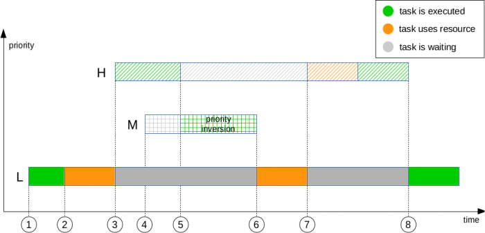
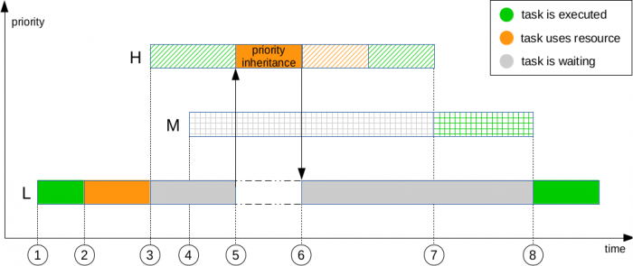

# 基本概念

互斥锁又称互斥型信号量，是一种特殊的二值性信号量，用于实现对共享资源的独占式处理。

任意时刻互斥锁的状态只有两种，开锁或闭锁。当有任务持有时，互斥锁处于闭锁状态，这个任务获得该互斥锁的所有权。当该任务释放它时，该互斥锁被开锁，任务失去该互斥锁的所有权。当一个任务持有互斥锁时，其他任务将不能再对该互斥锁进行开锁或持有。

多任务环境下往往存在多个任务竞争同一共享资源的应用场景，互斥锁可被用于对共享资源的保护从而实现独占式访问。另外互斥锁可以解决信号量存在的优先级翻转问题。

**表1** 互斥锁模块接口

| 功能分类           | 接口名        | 描述             |
| ------------------ | ------------- | ---------------- |
| 互斥锁的创建和删除 | LOS_MuxCreate | 创建互斥锁       |
|                    | LOS_MuxDelete | 删除指定的互斥锁 |
| 互斥锁的申请和释放 | LOS_MuxPend   | 申请指定的互斥锁 |
|                    | LOS_MuxPost   | 释放指定的互斥锁 |

## 开发流程

互斥锁典型场景的开发流程：

1. 创建互斥锁LOS_MuxCreate。
2. 申请互斥锁LOS_MuxPend。
    申请模式有三种：无阻塞模式、永久阻塞模式、定时阻塞模式。
    - 无阻塞模式：任务需要申请互斥锁，若该互斥锁当前没有任务持有，或者持有该互斥锁的任务和申请该互斥锁的任务为同一个任务，则申请成功。
    - 永久阻塞模式：任务需要申请互斥锁，若该互斥锁当前没有被占用，则申请成功。否则，该任务进入阻塞态，系统切换到就绪任务中优先级高者继续执行。任务进入阻塞态后，直到有其他任务释放该互斥锁，阻塞任务才会重新得以执行。
    - 定时阻塞模式：任务需要申请互斥锁，若该互斥锁当前没有被占用，则申请成功。否则该任务进入阻塞态，系统切换到就绪任务中优先级高者继续执行。任务进入阻塞态后，指定时间超时前有其他任务释放该互斥锁，或者用户指定时间超时后，阻塞任务才会重新得以执行。
3. 释放互斥锁LOS_MuxPost。
    - 如果有任务阻塞于指定互斥锁，则唤醒被阻塞任务中优先级高的，该任务进入就绪态，并进行任务调度；
    - 如果没有任务阻塞于指定互斥锁，则互斥锁释放成功。
4. 删除互斥锁LOS_MuxDelete。

# 初始化

mutex使用`LosMuxCB`进行管理

```c
typedef struct {
    UINT8 muxStat;       /**< State OS_MUX_UNUSED,OS_MUX_USED  */
    UINT16 muxCount;     /**< Times of locking a mutex */
    UINT32 muxID;        /**< Handle ID */
    LOS_DL_LIST muxList; /**< Mutex linked list */
    LosTaskCB *owner;    /**< The current thread that is locking a mutex */
    UINT16 priority;     /**< Priority of the thread that is locking a mutex */
} LosMuxCB;
```


```c
LITE_OS_SEC_TEXT_INIT UINT32 OsMuxInit(VOID)
{
    LosMuxCB *muxNode = NULL;
    UINT32 index;

    // 初始化全局双向循环链表
    LOS_ListInit(&g_unusedMuxList);

    if (LOSCFG_BASE_IPC_MUX_LIMIT == 0) {
        return LOS_ERRNO_MUX_MAXNUM_ZERO;
    }

    // 从动态内存中申请空间，共10个mutex
    g_allMux = (LosMuxCB *)LOS_MemAlloc(m_aucSysMem0, (LOSCFG_BASE_IPC_MUX_LIMIT * sizeof(LosMuxCB)));
    if (g_allMux == NULL) {
        return LOS_ERRNO_MUX_NO_MEMORY;
    }

    // 初始化，并使用尾插法插入g_unusedMuxList链表
    for (index = 0; index < LOSCFG_BASE_IPC_MUX_LIMIT; index++) {
        muxNode = ((LosMuxCB *)g_allMux) + index;
        muxNode->muxID = index;
        muxNode->owner = (LosTaskCB *)NULL;
        muxNode->muxStat = OS_MUX_UNUSED;
        LOS_ListTailInsert(&g_unusedMuxList, &muxNode->muxList);
    }
    return LOS_OK;
}
```

初始化的工作十分简单，

1. 初始化全局双向循环链表`g_unusedMuxList`用于存储未使用的mutexCB
2. 从动态内存中申请空间，共10个mutex
3. 按照数组初始化每一个mutexCB，并使用尾插法插入g_unusedMuxList链表

# 创建mutex

该函数接收一个参数muxHandle，用于写入被分配的muxCB的ID。

```c
LITE_OS_SEC_TEXT_INIT UINT32 LOS_MuxCreate(UINT32 *muxHandle)
{
    UINT32 intSave;
    LosMuxCB *muxCreated = NULL;
    LOS_DL_LIST *unusedMux = NULL;
    UINT32 errNo;
    UINT32 errLine;

    if (muxHandle == NULL) {
        return LOS_ERRNO_MUX_PTR_NULL;
    }

    intSave = LOS_IntLock();
    // 如果没有可用的mutexCB，错误处理，返回
    if (LOS_ListEmpty(&g_unusedMuxList)) {
        LOS_IntRestore(intSave);
        OS_GOTO_ERR_HANDLER(LOS_ERRNO_MUX_ALL_BUSY);
    }

    // 链表中选择第一个元素，并从链表中删除
    unusedMux = LOS_DL_LIST_FIRST(&(g_unusedMuxList));
    LOS_ListDelete(unusedMux);

    // 对mutexCB属性进行赋值，state标记为used，初始化muxList链表
    muxCreated = (GET_MUX_LIST(unusedMux));
    muxCreated->muxCount = 0;
    muxCreated->muxStat = OS_MUX_USED;
    muxCreated->priority = 0;
    muxCreated->owner = (LosTaskCB *)NULL;
    LOS_ListInit(&muxCreated->muxList);

    // 把muxID赋值给muxHandle，使得用户可以根据muxHandle操作mutex
    *muxHandle = (UINT32)muxCreated->muxID;
    LOS_IntRestore(intSave);
    OsHookCall(LOS_HOOK_TYPE_MUX_CREATE, muxCreated);
    return LOS_OK;
ERR_HANDLER:
    OS_RETURN_ERROR_P2(errLine, errNo);
}
```

# 删除mutex

```c
LITE_OS_SEC_TEXT_INIT UINT32 LOS_MuxDelete(UINT32 muxHandle)
{
    UINT32 intSave;
    LosMuxCB *muxDeleted = NULL;
    UINT32 errNo;
    UINT32 errLine;

    // 检查ID是否合法
    if (muxHandle >= (UINT32)LOSCFG_BASE_IPC_MUX_LIMIT) {
        OS_GOTO_ERR_HANDLER(LOS_ERRNO_MUX_INVALID);
    }

    // 根据id获取mutexCB
    muxDeleted = GET_MUX(muxHandle);
    intSave = LOS_IntLock();

    // 如果状态是unused，返回错误
    if (muxDeleted->muxStat == OS_MUX_UNUSED) {
        LOS_IntRestore(intSave);
        OS_GOTO_ERR_HANDLER(LOS_ERRNO_MUX_INVALID);
    }

    // 如果muxList非空或muxCount不为0,表示仍然被使用，返回错误
    if ((!LOS_ListEmpty(&muxDeleted->muxList)) || muxDeleted->muxCount) {
        LOS_IntRestore(intSave);
        OS_GOTO_ERR_HANDLER(LOS_ERRNO_MUX_PENDED);
    }

    // 使用头插法，将mutexCB插入空闲链表，设置state为未使用
    LOS_ListAdd(&g_unusedMuxList, &muxDeleted->muxList);
    muxDeleted->muxStat = OS_MUX_UNUSED;

    LOS_IntRestore(intSave);

    OsHookCall(LOS_HOOK_TYPE_MUX_DELETE, muxDeleted);
    return LOS_OK;
ERR_HANDLER:
    OS_RETURN_ERROR_P2(errLine, errNo);
}
```

# P-V操作

## p操作 - LOS_MuxPend

以下称为加锁

```c
LITE_OS_SEC_TEXT UINT32 LOS_MuxPend(UINT32 muxHandle, UINT32 timeout)
{
    UINT32 intSave;
    LosMuxCB *muxPended = NULL;
    UINT32 retErr;
    LosTaskCB *runningTask = NULL;

    if (muxHandle >= (UINT32)LOSCFG_BASE_IPC_MUX_LIMIT) {
        OS_RETURN_ERROR(LOS_ERRNO_MUX_INVALID);
    }

    // 根据muxID获取mutexCB
    muxPended = GET_MUX(muxHandle);
    intSave = LOS_IntLock();
    // mutex前的合法性检查
    retErr = OsMuxValidCheck(muxPended);
    if (retErr) {
        goto ERROR_MUX_PEND;
    }

    runningTask = (LosTaskCB *)g_losTask.runTask;
    // 1.如果count==0,证明没有其他任务对其加锁
    if (muxPended->muxCount == 0) {
        muxPended->muxCount++;
        muxPended->owner = runningTask;
        muxPended->priority = runningTask->priority;
        LOS_IntRestore(intSave);
        goto HOOK;
    }

    // 2.虽然之前已经加锁，但是加锁的是自己，锁的可重入性
    if (muxPended->owner == runningTask) {
        muxPended->muxCount++;
        LOS_IntRestore(intSave);
        goto HOOK;
    }

    // 3. 之前已加锁，且不是自己，此时应该进行锁等待
    // 如果timeout==0,返回错误
    if (!timeout) {
        retErr = LOS_ERRNO_MUX_UNAVAILABLE;
        goto ERROR_MUX_PEND;
    }
    // 给taskMux赋值
    runningTask->taskMux = (VOID *)muxPended;

    // 如果mutexCB持有者的优先级的值 > 当前运行task的优先级（这里值越大则优先级越小）
    // 则修改mutexCB持有者的权限为当前运行task的权限，
    // 即如果进行锁等待的任务优先级大于mutex持有者的优先级，则提高持有者的优先级，优先级继承，解决优先级反转问题
    if (muxPended->owner->priority > runningTask->priority) {
        (VOID)OsSchedModifyTaskSchedParam(muxPended->owner, runningTask->priority);
    }

    // 将runTask加入muxPended等待队列
    OsSchedTaskWait(&muxPended->muxList, timeout);

    LOS_IntRestore(intSave);
    OsHookCall(LOS_HOOK_TYPE_MUX_PEND, muxPended, timeout);
    // 调度
    LOS_Schedule();

    intSave = LOS_IntLock();
    if (runningTask->taskStatus & OS_TASK_STATUS_TIMEOUT) {
        runningTask->taskStatus &= (~OS_TASK_STATUS_TIMEOUT);
        retErr = LOS_ERRNO_MUX_TIMEOUT;
        goto ERROR_MUX_PEND;
    }

    LOS_IntRestore(intSave);
    return LOS_OK;

HOOK:
    OsHookCall(LOS_HOOK_TYPE_MUX_PEND, muxPended, timeout);
    return LOS_OK;

ERROR_MUX_PEND:
    LOS_IntRestore(intSave);
    OS_RETURN_ERROR(retErr);
}
```

1. 第16行的合法性检查，规定了以下情况是非法的：
    1.  mutexCB muxStat是未使用
    2. 处于中断处理中，g_intCount > 0 
    3. task处于锁定状态，g_losTaskLock > 0
    4. g_losTask.runTask 是系统任务


接下来是对加锁状态的判断和加锁或等待锁的重要逻辑，其中涉及了优先级继承，详见[优先级反转优先级继承](#优先级反转优先级继承)。

**情况1：没有task对mutex加锁**

- 此时mutex的count == 0，直接对count++
- 设置mutex的持有者（owner）为当前task
- 设置mutex的优先级为当前task的优先级
- 直接返回

**情况2：mutex已被加锁，但加锁的是当前task（本身）**

- 此时mutex的持有者（owner）是当前task
- 其他信息均不用修改，只修改count即可，count++。这里表明了mutex是可重入的
- 直接返回

**情况3：mutex已被其他task加锁，当前task需等待释放**

- 如果timeout==0,返回错误
- 给`runningTask->taskMux`赋值，表示当前task等待的mutex是哪个mutexCB
- 如果当前任务的优先级==大于==mutex的持有者的优先级，则提高持有者的优先级为当前任务的优先级。[优先级反转优先级继承](#优先级反转优先级继承)
- 将当前任务加入`muxPended->muxList`等待队列中
- 调用`LOS_Schedule()`进行任务调度


## v操作 - LOS_MuxPost

以下称为解锁

```c
LITE_OS_SEC_TEXT UINT32 LOS_MuxPost(UINT32 muxHandle)
{
    UINT32 intSave;
    LosMuxCB *muxPosted = GET_MUX(muxHandle);
    LosTaskCB *resumedTask = NULL;
    LosTaskCB *runningTask = NULL;

    intSave = LOS_IntLock();

    // muxId和状态校验
    if ((muxHandle >= (UINT32)LOSCFG_BASE_IPC_MUX_LIMIT) ||
        (muxPosted->muxStat == OS_MUX_UNUSED)) {
        LOS_IntRestore(intSave);
        OS_RETURN_ERROR(LOS_ERRNO_MUX_INVALID);
    }

    // 处于中断处理中，g_intCount > 0 
    if (OS_INT_ACTIVE) {
        LOS_IntRestore(intSave);
        OS_RETURN_ERROR(LOS_ERRNO_MUX_IN_INTERR);
    }

    runningTask = (LosTaskCB *)g_losTask.runTask;
    // 1. 如果mutex未被加锁，或持有者不是自己，返回错误
    if ((muxPosted->muxCount == 0) || (muxPosted->owner != runningTask)) {
        LOS_IntRestore(intSave);
        OS_RETURN_ERROR(LOS_ERRNO_MUX_INVALID);
    }

    // 2.如果解锁后，count仍大于0,返回LOS_OK
    if (--(muxPosted->muxCount) != 0) {
        LOS_IntRestore(intSave);
        OsHookCall(LOS_HOOK_TYPE_MUX_POST, muxPosted);
        return LOS_OK;
    }

    // 3. 解锁后，count==0
    // 如果持有者的优先级与muxPosted的优先级不同，则修改持有者的优先级为原始优先级
    if ((muxPosted->owner->priority) != muxPosted->priority) {
        (VOID)OsSchedModifyTaskSchedParam(muxPosted->owner, muxPosted->priority);
    }

    // 如果等待列表非空
    if (!LOS_ListEmpty(&muxPosted->muxList)) {
        // 取出第一个元素
        resumedTask = OS_TCB_FROM_PENDLIST(LOS_DL_LIST_FIRST(&(muxPosted->muxList)));

        muxPosted->muxCount = 1;
        muxPosted->owner = resumedTask; // 持有者设为resumedTask
        muxPosted->priority = resumedTask->priority; // 设置优先级
        resumedTask->taskMux = NULL;  // 修改为NULL

        OsSchedTaskWake(resumedTask); // 唤醒resumedTask

        LOS_IntRestore(intSave);
        OsHookCall(LOS_HOOK_TYPE_MUX_POST, muxPosted);
        LOS_Schedule();              // 调度
    } else {
        muxPosted->owner = NULL;
        LOS_IntRestore(intSave);
    }

    return LOS_OK;
}
```

解锁前首先对参数合法性和系统状态进行判断：

- mutexID >= 10非法。--- 11行
- mutexCB状态为unused非法。 --- 12行
- 处于中断处理中（g_intCount > 0）非法。 --- 18行
- ==mutex未被加锁或mutex持有者不是当前task，非法== --- 25行


解锁过程有2种情况：

**情况1：mutex解锁之后count仍大于0**

- 直接返回解锁成功

**情况2：mutex解锁之后count等于0**

- 如果持有者的优先级与muxPosted的优先级不同，则修改持有者的优先级为原始优先级
- 如果等待列表非空，证明有task在等待当前的mutex
    - 从`muxPosted->muxList`等待链表中取出第一个元素，`resumedTask`
    - 设置count=1
    - 设置mutex持有者为`resumedTask`
    - 设置mutex优先级为`resumedTask`的优先级
    - 设置`resumedTask->taskMux = NULL`
    - 唤醒`resumedTask`
    - 调用`LOS_Schedule()`进行任务调度
- 否则（如果等待列表为空），设置设置mutex持有者为NULL

# 优先级反转优先级继承

> Priority inheritance is a way to solve the problem called priority inversion.

优先级继承是解决优先级反转问题的一种方法

## 优先级反转



> - A task with low priority L becomes runnable and starts executing (1).
> - It acquires a mutually exclusive resource (2).
> - Now a task with a higher priority H becomes runnable and preempts L while L is holding the resource (3).
> - A third task M with priority between Hs and Ls priority (and with no need for the resource) becomes runnable, but it has to wait because H with higher priority is running (4).
> - H needs the resource still held by L (5), and so H stops running to wait until the resource is released.
> - The runnable task M prevents L from executing because of its higher priority. This leads to the priority inversion because H has to wait until M has finished (6) so that L can release the resource (7).

1. 低优先级任务L开始运行

2. 任务L获得互斥资源
3. 高优先级任务H开始执行，并试图抢占L
4. 第三个任务M优先级在H和L之间（并且不需要资源），但是由于H正在运行，因此M需要进行等待
5. H所需的资源仍被L持有，因此H停止运行，直到资源被L释放。
6. 由于M的优先级比L高，因此会先指向M。这导致了==优先级反转==：H需要等待M执行完毕，M执行完毕L才能释放资源。

## 优先级继承



> This means than when H needs the resource held by L, L inherits H's priority (5) in order to release the resource sooner (6). When M gets ready to run, M has to wait until the currently higher prioritized task L releases the resource and H finishes running (7).

当H需要L持有的资源时，L继承H的优先级。

当M就绪时，M需要等待高优先级的L资源及H结束运行。