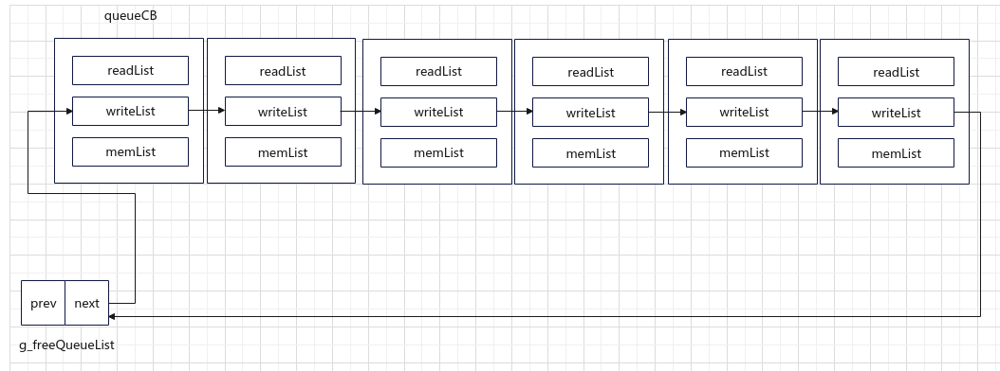
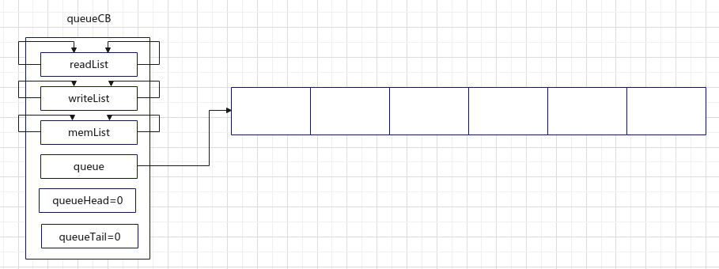
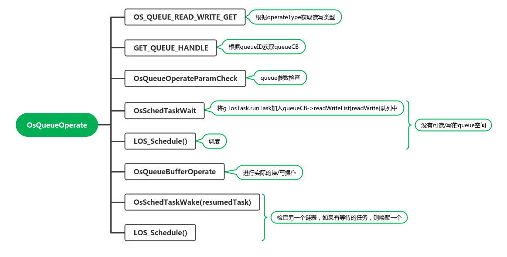
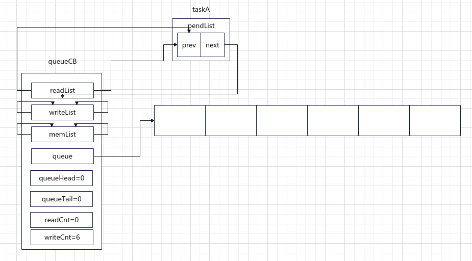
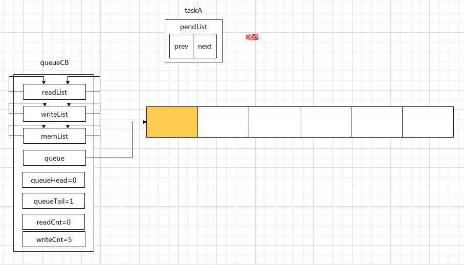
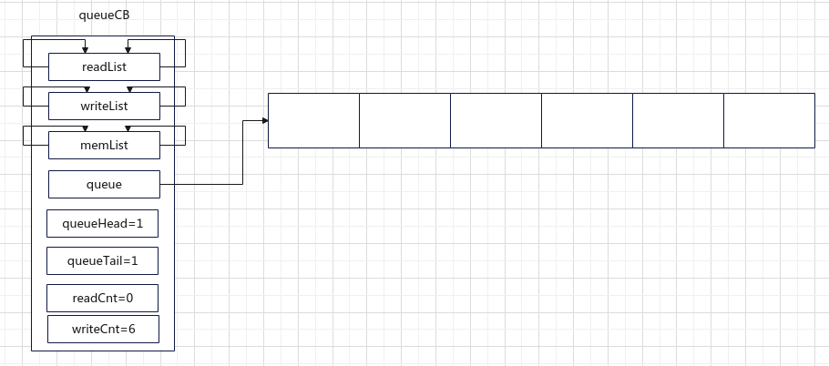

# 初始化

```c
typedef struct {
    UINT8 *queue;      /**< Pointer to a queue handle */
    UINT16 queueState; /**< Queue state */
    UINT16 queueLen;   /**< Queue length */
    UINT16 queueSize;  /**< Node size */
    UINT16 queueID;    /**< queueID */
    UINT16 queueHead;  /**< Node head */
    UINT16 queueTail;  /**< Node tail */
    UINT16 readWriteableCnt[OS_READWRITE_LEN]; /**< Count of readable or writable resources, 0:readable, 1:writable */
    LOS_DL_LIST readWriteList[OS_READWRITE_LEN]; /**< Pointer to the linked list to be read or written,
                                                      0:readlist, 1:writelist */
    LOS_DL_LIST memList; /**< Pointer to the memory linked list */
} LosQueueCB;


LITE_OS_SEC_TEXT_INIT UINT32 OsQueueInit(VOID)
{
    LosQueueCB *queueNode = NULL;
    UINT16 index;

    if (LOSCFG_BASE_IPC_QUEUE_LIMIT == 0) {
        return LOS_ERRNO_QUEUE_MAXNUM_ZERO;
    }

    // 初始化队列，共有6个Queue CB
    g_allQueue = (LosQueueCB *)LOS_MemAlloc(m_aucSysMem0, LOSCFG_BASE_IPC_QUEUE_LIMIT * sizeof(LosQueueCB));
    if (g_allQueue == NULL) {
        return LOS_ERRNO_QUEUE_NO_MEMORY;
    }

    // 初始化为0值
    (VOID)memset_s(g_allQueue, LOSCFG_BASE_IPC_QUEUE_LIMIT * sizeof(LosQueueCB),
                   0, LOSCFG_BASE_IPC_QUEUE_LIMIT * sizeof(LosQueueCB));

    // 使用g_freeQueueList作为头结点管理所有队列，index为[0:5]
    LOS_ListInit(&g_freeQueueList);
    for (index = 0; index < LOSCFG_BASE_IPC_QUEUE_LIMIT; index++) {
        queueNode = ((LosQueueCB *)g_allQueue) + index;
        queueNode->queueID = index;
        LOS_ListTailInsert(&g_freeQueueList, &queueNode->readWriteList[OS_QUEUE_WRITE]);
    }

    return LOS_OK;
}
```



**注：**本图是一个示意图，实际的链表是一个双向循环链表，图中只画了next指针

# 队列创建

```c
LITE_OS_SEC_TEXT_INIT UINT32 LOS_QueueCreate(const CHAR *queueName,
                                             UINT16 len,
                                             UINT32 *queueID,
                                             UINT32 flags,
                                             UINT16 maxMsgSize)
{
    LosQueueCB *queueCB = NULL;
    UINT32 intSave;
    LOS_DL_LIST *unusedQueue = NULL;
    UINT8 *queue = NULL;
    UINT16 msgSize;

    (VOID)queueName;
    (VOID)flags;

    // 参数合法性验证
    if (queueID == NULL) {
        return LOS_ERRNO_QUEUE_CREAT_PTR_NULL;
    }

    if (maxMsgSize > (OS_NULL_SHORT - sizeof(UINT32))) {
        return LOS_ERRNO_QUEUE_SIZE_TOO_BIG;
    }

    if ((len == 0) || (maxMsgSize == 0)) {
        return LOS_ERRNO_QUEUE_PARA_ISZERO;
    }

    // 消息大小为最大消息大小+4字节
    msgSize = maxMsgSize + sizeof(UINT32);

    /* Memory allocation is time-consuming, to shorten the time of disable interrupt,
       move the memory allocation to here. */
    // 如果消息个数*每个消息的大小大于32位最大值，则消息队列中消息的大小可能会太大，不允许
    if ((UINT32_MAX / msgSize) < len) {
        return LOS_ERRNO_QUEUE_SIZE_TOO_BIG;
    }
    // 申请空间，消息队列中的消息是一个数组，一次申请全部所需空间
    queue = (UINT8 *)LOS_MemAlloc(m_aucSysMem0, (UINT32)len * msgSize);
    if (queue == NULL) {
        return LOS_ERRNO_QUEUE_CREATE_NO_MEMORY;
    }

    intSave = LOS_IntLock();
    // 如果没有可用的QueueCB,释放内存，返回错误
    if (LOS_ListEmpty(&g_freeQueueList)) {
        LOS_IntRestore(intSave);
        (VOID)LOS_MemFree(m_aucSysMem0, queue);
        return LOS_ERRNO_QUEUE_CB_UNAVAILABLE;
    }

    // 从g_freeQueueList取出元素，对queueCB进行初始化，queueCB管理3个链表
    unusedQueue = LOS_DL_LIST_FIRST(&(g_freeQueueList));
    LOS_ListDelete(unusedQueue);
    queueCB = (GET_QUEUE_LIST(unusedQueue));
    queueCB->queueLen = len;
    queueCB->queueSize = msgSize;
    queueCB->queue = queue;
    queueCB->queueState = OS_QUEUE_INUSED;
    queueCB->readWriteableCnt[OS_QUEUE_READ] = 0;  // 表示可读的元素数量 0
    queueCB->readWriteableCnt[OS_QUEUE_WRITE] = len; // 表示可写的元素数量 6
    queueCB->queueHead = 0;
    queueCB->queueTail = 0;
    LOS_ListInit(&queueCB->readWriteList[OS_QUEUE_READ]);  // 读链表
    LOS_ListInit(&queueCB->readWriteList[OS_QUEUE_WRITE]); // 写链表
    LOS_ListInit(&queueCB->memList);
    LOS_IntRestore(intSave);

    *queueID = queueCB->queueID;

    OsHookCall(LOS_HOOK_TYPE_QUEUE_CREATE, queueCB);

    return LOS_OK;
}
```




# 读写消息

## 读消息队列

```c
LITE_OS_SEC_TEXT UINT32 LOS_QueueReadCopy(UINT32 queueID,
                                          VOID *bufferAddr,
                                          UINT32 *bufferSize,
                                          UINT32 timeOut)
{
    UINT32 ret;
    UINT32 operateType;

    ret = OsQueueReadParameterCheck(queueID, bufferAddr, bufferSize, timeOut);
    if (ret != LOS_OK) {
        return ret;
    }

    operateType = OS_QUEUE_OPERATE_TYPE(OS_QUEUE_READ, OS_QUEUE_HEAD, OS_QUEUE_NOT_POINT);
    return OsQueueOperate(queueID, operateType, bufferAddr, bufferSize, timeOut);
}
```

## 写消息队列

```c
LITE_OS_SEC_TEXT UINT32 LOS_QueueWriteCopy(UINT32 queueID,
                                           VOID *bufferAddr,
                                           UINT32 bufferSize,
                                           UINT32 timeOut)
{
    UINT32 ret;
    UINT32 operateType;

    ret = OsQueueWriteParameterCheck(queueID, bufferAddr, &bufferSize, timeOut);
    if (ret != LOS_OK) {
        return ret;
    }

    operateType = OS_QUEUE_OPERATE_TYPE(OS_QUEUE_WRITE, OS_QUEUE_TAIL, OS_QUEUE_NOT_POINT);
    return OsQueueOperate(queueID, operateType, bufferAddr, &bufferSize, timeOut);
}

```

## OsQueueOperate

读写消息队列都调用了`OsQueueOperate`函数,该函数根据operateType决定具体的操作



```c
UINT32 OsQueueOperate(UINT32 queueID, UINT32 operateType, VOID *bufferAddr, UINT32 *bufferSize, UINT32 timeOut)
{
    LosQueueCB *queueCB = NULL;
    LosTaskCB *resumedTask = NULL;
    UINT32 ret;
    UINT32 readWrite = OS_QUEUE_READ_WRITE_GET(operateType);
    UINT32 readWriteTmp = !readWrite;

    UINT32 intSave = LOS_IntLock();

    queueCB = (LosQueueCB *)GET_QUEUE_HANDLE(queueID);
    ret = OsQueueOperateParamCheck(queueCB, operateType, bufferSize);
    if (ret != LOS_OK) {
        goto QUEUE_END;
    }

    // 如果要读写的链表为空，则将task加入readWriteList[readWrite]队列，
    // 把task置为PEND（timeOut == LOS_WAIT_FOREVER）或PEND_TIME状态
    if (queueCB->readWriteableCnt[readWrite] == 0) {
        if (timeOut == LOS_NO_WAIT) {
            ret = OS_QUEUE_IS_READ(operateType) ? LOS_ERRNO_QUEUE_ISEMPTY : LOS_ERRNO_QUEUE_ISFULL;
            goto QUEUE_END;
        }

        if (g_losTaskLock) {
            ret = LOS_ERRNO_QUEUE_PEND_IN_LOCK;
            goto QUEUE_END;
        }

        LosTaskCB *runTsk = (LosTaskCB *)g_losTask.runTask;
        OsSchedTaskWait(&queueCB->readWriteList[readWrite], timeOut);
        LOS_IntRestore(intSave);
        LOS_Schedule();

        intSave = LOS_IntLock();
        if (runTsk->taskStatus & OS_TASK_STATUS_TIMEOUT) {
            runTsk->taskStatus &= ~OS_TASK_STATUS_TIMEOUT;
            ret = LOS_ERRNO_QUEUE_TIMEOUT;
            goto QUEUE_END;
        }
    } else {
        queueCB->readWriteableCnt[readWrite]--;
    }

    OsQueueBufferOperate(queueCB, operateType, bufferAddr, bufferSize);

    // 如果另一个链表（本身为读，则另一个为写）非空，
    if (!LOS_ListEmpty(&queueCB->readWriteList[readWriteTmp])) {
        // 从链表取出一个元素，并resume
        resumedTask = OS_TCB_FROM_PENDLIST(LOS_DL_LIST_FIRST(&queueCB->readWriteList[readWriteTmp]));
        OsSchedTaskWake(resumedTask);
        LOS_IntRestore(intSave);
        LOS_Schedule();
        return LOS_OK;
    } else {
        queueCB->readWriteableCnt[readWriteTmp]++;
    }

QUEUE_END:
    LOS_IntRestore(intSave);
    return ret;
}
```

### 举例

下面给出一个读写的例子：taskA首先进行读，taskB进行写，来观察各个数据结构和变量的变化

1. taskA进行读，由于队列中没有数据，因此taskA会进入PEND状态，并连接到readList（queueCB->readWriteList[0]）中
2. 调用`LOS_Schedule()`，进行一次主动的调度



2. taskB进行写，假设使用尾插（OS_QUEUE_TAIL）

    1. writeCnt--；变成5
    2. 会使用第0块内存写入信息，queueTail变为1
    3. 之后检查readList（queueCB->readWriteList[0]），发现该链表不为空，则对该任务进行唤醒，加入就绪队列，并调用`LOS_Schedule()`，进行一次主动的调度

    

3. 如果此时taskA得到了调度，则TaskA从数组中读出信息，

    1. 把queueHead++；编程1
    2. writeCnt+1 = 6

    

# Q&A

## memList的作用是什么？

queue可以管理一个静态内存池，

当从静态内存池没有可分配空间时，需要进行等待的task会加入到memList链表中。

```c
LITE_OS_SEC_TEXT VOID *OsQueueMailAlloc(UINT32 queueID, VOID *mailPool, UINT32 timeOut)
{
    VOID *mem = (VOID *)NULL;
    UINT32 intSave;
    LosQueueCB *queueCB = (LosQueueCB *)NULL;
    LosTaskCB *runTsk = (LosTaskCB *)NULL;

    if (queueID >= LOSCFG_BASE_IPC_QUEUE_LIMIT) {
        return NULL;
    }

    if (mailPool == NULL) {
        return NULL;
    }

    if (timeOut != LOS_NO_WAIT) {
        if (OS_INT_ACTIVE) {
            return NULL;
        }
    }

    intSave = LOS_IntLock();

    // 获取queueCB
    queueCB = GET_QUEUE_HANDLE(queueID);
    if (queueCB->queueState == OS_QUEUE_UNUSED) {
        goto END;
    }

    // 从静态内存池申请内存
    mem = LOS_MemboxAlloc(mailPool);
    if (mem == NULL) {
        if (timeOut == LOS_NO_WAIT) {
            goto END;
        }

        runTsk = (LosTaskCB *)g_losTask.runTask;
        // 加入memList，进行等待
        OsSchedTaskWait(&queueCB->memList, timeOut);
        LOS_IntRestore(intSave);
        LOS_Schedule();

        intSave = LOS_IntLock();
        if (runTsk->taskStatus & OS_TASK_STATUS_TIMEOUT) {
            runTsk->taskStatus &= (~OS_TASK_STATUS_TIMEOUT);
            goto END;
        } else {
            /* When enters the current branch, means the current task already got an available membox,
             * so the runTsk->msg can not be NULL.
             */
            mem = runTsk->msg;
            runTsk->msg = NULL;
        }
    }

END:
    LOS_IntRestore(intSave);
    return mem;
}
```

