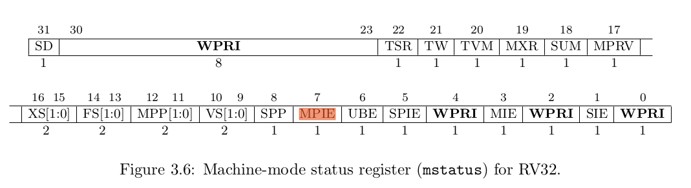

# 任务调度

## 初始化

任务调度的初始化由函数完成，该函数在task初始化（`OsTaskInit`）阶段被调用

```c
UINT32 OsSchedInit(VOID)
{
    UINT16 pri;
    // 初始化每一个优先级队列双向链表，前向后向指针均指向本身
    for (pri = 0; pri < OS_PRIORITY_QUEUE_NUM; pri++) {
        LOS_ListInit(&g_priQueueList[pri]);
    }
    // 某一位为1表示该下标优先级队列有任务
    g_queueBitmap = 0;

    // g_taskSortLinkList = g_taskSortLink
    g_taskSortLinkList = OsGetSortLinkAttribute(OS_SORT_LINK_TASK);
    if (g_taskSortLinkList == NULL) {
        return LOS_NOK;
    }

    // 初始化成员 sortLink， g_taskSortLinkList 中只有一个成员 LOS_DL_LIST sortLink;
    OsSortLinkInit(g_taskSortLinkList);
    // 初始化调度响应时间为最大值，设置 g_schedResponseTime 为 ((UINT64)-1)
    g_schedResponseTime = OS_SCHED_MAX_RESPONSE_TIME;

    return LOS_OK;
}
```

1. 初始化优先级队列的双链表，共有32个优先级，[0:31]依次是最高到最低优先级，链表中存放就绪态的task。 ----- 6行
2. 由于优先级队列中没有task，初始化g_queueBitmap为0。--- 9行
3. g_taskSortLinkList = g_taskSortLink。--- 12行
4. 初始化g_taskSortLinkList的成员sortLink。--- 18行
5. 初始化调度响应时间为最大值，设置 g_schedResponseTime 为 ((UINT64)-1)。--- 20行

## 开启调度-OsSchedStart

OsSchedStart的调用链是：

```
LOS_Start --> ArchStartSchedule --> OsSchedStart 
```

`LOS_Start`函数在[2. liteos-m源码分析 - 内核初始化](./liteos-m-source-kernel-init.md)的`mian.c`一节中被介绍，该函数的调用次序在==用户任务创建完成==之后。

```c
// kernel/src/los_sched.c
VOID OsSchedStart(VOID)
{
    PRINTK("Entering scheduler\n");

    (VOID)LOS_IntLock();
    // 获取就绪队列中优先级最高的任务
    LosTaskCB *newTask = OsGetTopTask();

    // 设置为运行状态
    newTask->taskStatus |= OS_TASK_STATUS_RUNNING;
    // newtask和runtask均设置为 newtask
    g_losTask.newTask = newTask;
    g_losTask.runTask = g_losTask.newTask;

    // 设置开始运行时间
    newTask->startTime = OsGetCurrSchedTimeCycle();
    // 从就绪队列中删除
    OsSchedTaskDeQueue(newTask);

    OsTickSysTimerStartTimeSet(newTask->startTime);

    OsSwtmrResponseTimeReset(newTask->startTime);

    /* Initialize the schedule timeline and enable scheduling */
    g_taskScheduled = TRUE;

    g_schedResponseTime = OS_SCHED_MAX_RESPONSE_TIME;
    g_schedResponseID = OS_INVALID;
    // 设置task过期时间
    OsSchedSetNextExpireTime(newTask->taskID, newTask->startTime + newTask->timeSlice);
}
```

1. `OsSchedStart`函数取出就绪队列中优先级最高的task，设置新任务的状态为`running`并设置全局变量g_losTask的`newTask`和`runTask`均为取出的任务。--- 7-14行
2. 设置新任务的开始时间为当前时间。 --- 17行
3. 将新任务从就绪队列只删除，取消其就绪状态。--- 19行
4. 设置全局变量`g_taskScheduled=True`表示系统开始允许调度。---26行
5. 设置task的过期事件。---31行


## 调度函数

这里仍然以risc-v为例，`LOS_Schedule`是最常用的调度函数，`LOS_Schedule`实际上会调用体系架构相关代码

```c
// kernel/src/los_sched.c
VOID LOS_Schedule(VOID)
{
    if (g_taskScheduled && LOS_CHECK_SCHEDULE) {
        ArchTaskSchedule();
    }
}
```

`ArchTaskSchedule`定义如下：

```c
VOID ArchTaskSchedule(VOID)
{
    UINT32 intSave;

    // if g_intCount > 0
    if (OS_INT_ACTIVE) {
        g_sysNeedSched = TRUE;
        return;
    }

    intSave = LOS_IntLock();
    g_sysNeedSched = FALSE;
    // 判断是否需要进行task switch
    BOOL isSwitch = OsSchedTaskSwitch();
    if (isSwitch) {
        HalTaskContextSwitch(intSave);
        return;
    }

    LOS_IntRestore(intSave);
    return;
}
```

1. 首先判断是否需要进行调度，返回值为true为需要调度。 --- 14行
2. 调用汇编代码进行实际上下文切换 -- 16行


```c
BOOL OsSchedTaskSwitch(VOID)
{
    UINT64 endTime;
    BOOL isTaskSwitch = FALSE;
    LosTaskCB *runTask = g_losTask.runTask;
    // 更新runtask的时间片，减去运行的时间片，开始时间设置为当前时间
    OsTimeSliceUpdate(runTask, OsGetCurrSchedTimeCycle());

    // 如果任务处于pend_time或delay状态
    if (runTask->taskStatus & (OS_TASK_STATUS_PEND_TIME | OS_TASK_STATUS_DELAY)) {
        // 按task responseTime大小顺序插入g_taskSortLink有序链表，head->next 是最小的
        OsAdd2SortLink(&runTask->sortList, runTask->startTime, runTask->waitTimes, OS_SORT_LINK_TASK);
    } else if (!(runTask->taskStatus & OS_TASK_BLOCKED_STATUS)) { // 阻塞状态的任务不加入就绪队列
        // 将任务加入优先级队列中，如果时间片大于最小时间片，插入头部，否则插入尾部
        OsSchedTaskEnQueue(runTask);
    }

    // 从就绪队列获取一个优先级最高的task
    LosTaskCB *newTask = OsGetTopTask();
    g_losTask.newTask = newTask;

    // 如果 runtask 和 newtask 不同，则切换task的状态，
    // 把newtask的状态设为running， runTask 状态设为非running
    // isTaskSwitch设为True
    if (runTask != newTask) {
#if (LOSCFG_BASE_CORE_TSK_MONITOR == 1)
        OsTaskSwitchCheck();
#endif
        runTask->taskStatus &= ~OS_TASK_STATUS_RUNNING;
        newTask->taskStatus |= OS_TASK_STATUS_RUNNING;
        newTask->startTime = runTask->startTime;   // 新任务的开始时间设置为runtask的开始时间，在599行更新过
        isTaskSwitch = TRUE;

        OsHookCall(LOS_HOOK_TYPE_TASK_SWITCHEDIN);
    }

    // 如果newTask是就绪态，则将该任务从优先级队列删除，并取消就绪态
    OsSchedTaskDeQueue(newTask);

    // 计算newtask的运行结束时间，开始时间+时间片大小
    if (newTask->taskID != g_idleTaskID) {
        endTime = newTask->startTime + newTask->timeSlice;
    } else {
        endTime = OS_SCHED_MAX_RESPONSE_TIME - OS_TICK_RESPONSE_PRECISION;
    }

    // 如果g_schedResponseID == runTask->taskID，设置g_schedResponseTime为最大值
    if (g_schedResponseID == runTask->taskID) {
        g_schedResponseTime = OS_SCHED_MAX_RESPONSE_TIME;
    }
    // 设置newtask过期时间
    OsSchedSetNextExpireTime(newTask->taskID, endTime);

    return isTaskSwitch;
}
```

该函数用于判断是否需要进行task switch

首先根据task状态判断应该把当前task放入哪个队列，

- 如果状态是PEND_TIME,DELAY，把task按task responseTime大小顺序插入g_taskSortLink有序链表。---12行。该链表在==时钟中断==时会进行检查，详见[6.liteos-m源码分析 - timer.md](./liteos-m-source-timer.md)时钟中断处理一节。
- 否则，如果状态不是BLOCK则把runtask插入就绪队列。---15行。

然后选择最高优先级的任务作为newtask。---19行

如果runtask和newtask相同则不需要切换，否则，切换，

这种切换逻辑保证了==最高优先级的任务会优先执行==


`OsSchedTaskEnQueue`将任务加入优先级队列中，如果时间片大于最小时间片，插入头部，否则（时间片用完）插入尾部，保证同级别的其他任务可以执行

```c
VOID OsSchedTaskEnQueue(LosTaskCB *taskCB)
{   
    // 断言：task状态应该是非ready
    LOS_ASSERT(!(taskCB->taskStatus & OS_TASK_STATUS_READY));

    if (taskCB->taskID != g_idleTaskID) {
        if (taskCB->timeSlice > OS_TIME_SLICE_MIN) {
            // 如果时间片大于最小时间片，则把task加入优先级为priority的队列中。
            OsSchedPriQueueEnHead(&taskCB->pendList, taskCB->priority);
        } else { // 时间片用完
            taskCB->timeSlice = OS_SCHED_TIME_SLICES;
            OsSchedPriQueueEnTail(&taskCB->pendList, taskCB->priority);
        }
        OsHookCall(LOS_HOOK_TYPE_MOVEDTASKTOREADYSTATE, taskCB);
    }

    taskCB->taskStatus &= ~(OS_TASK_STATUS_PEND | OS_TASK_STATUS_SUSPEND |
                            OS_TASK_STATUS_DELAY | OS_TASK_STATUS_PEND_TIME);

    taskCB->taskStatus |= OS_TASK_STATUS_READY;
}
```


## HalTaskContextSwitch 汇编

`HalTaskContextSwitch`有一个参数，即a0寄存器的值是intsave

```c
intSave = LOS_IntLock();
HalTaskContextSwitch(intSave);
```

`LOS_IntLock()`也是由汇编定义的（在riscv下）

```c
ArchIntLock:
    csrr    a0, mstatus           // return value
    li      t0, RISCV_MSTATUS_MIE   // t0 = 0x0000 0008
    csrrc   zero, mstatus, t0     // clear MIE 中断禁止
    ret

ArchIntUnLock:
    csrr    a0, mstatus           // return value
    li      t0, RISCV_MSTATUS_MIE   // t0 = 0x0000 0008
    csrrs   zero, mstatus, t0     // set MIE 中断使能
    ret
```



```c
HalTaskContextSwitch:
    PUSH_ALL_REG   // 保存g_losTask.runTask寄存器的值至栈

    // clear mpie, a0 = mstatus 寄存器，由ArchIntLock而来，第8位表示MPIE
    li   a2, RISCV_MSTATUS_MPIE  // a2 = 0x0000 0080
    not  a2, a2      // a2 = 0xFFFF FF7F
    and  a0, a0, a2  // a0 = a0 and a2

    // get mie
    andi a1, a0, RISCV_MSTATUS_MIE  # a1 = a0 & 0x00000008, 获得mie位的值

    // must be in machine mode
    ori  a1, a1, 0x180  # a1 = 0x188
    slli a1, a1, 0x4    # a1 = 0x1880,即MPP = 0x11 机器模式
    or   a0, a0, a1     # a0 = a0 | a1 ,设置MPP同时设置MPIE = 1
    # 上面的代码完成了清除MPIE位，获取MIE位，设置MPP=0x11，设置MPIE = 1

    // clear mie
    li   a2, RISCV_MSTATUS_MIE  # a2 = 0x0000 0008
    not  a2, a2                 # a2 = 0xffff fff7
    and  a0, a0, a2             # a0 = a0 | a2 = 0x1880,清除mie位

    SREG a0, 16 * REGBYTES(sp)  # 保存a0和ra
    SREG ra, 17 * REGBYTES(sp)

    la   a1, g_losTask  # a1 = g_losTask
    lw   a0, 0(a1)      # a0 = g_losTask.runTask
    sw   sp, TASK_CB_KERNEL_SP(a0)  # 保存sp 至a0栈

    lw   a0, 4(a1)      # a0 = g_losTask.newTask
    sw   a0, 0(a1)      # g_losTask.runTask = a0

HalStartToRun:
    la   a1, g_losTask  # a1 = g_losTask
    lw   a0, 4(a1)      # a0 = g_losTask.newTask

// retireve stack pointer
    lw      sp, TASK_CB_KERNEL_SP(a0)  // sp 指针指向 newTask 的sp

    lw      t0, 16 * REGBYTES(sp)
    csrw    mstatus, t0

// retrieve the address at which exception happened
    lw      t0, 17 * REGBYTES(sp)
    csrw    mepc, t0

// retrieve the registers
    POP_ALL_REG   // 从栈中恢复寄存器的值，开始执行 newTask

    mret
```


# 调度算法

liteos-m 调度的依据是优先级和时间片

1. task初始化时时间片为0. --- OsNewTaskInit()
2. 随后在插入就绪队列时，由于时间片为0,所以会给该任务的时间片一个默认值，并将任务插在优先级队列的尾部
3. 初始情况下，会选择优先级最高的队列中的首元素进行执行
4. 在执行过程中，由于主动调用`LOS_Schedule`或系统时钟中断都会引起对是否需要进行task切换的判断
    1. 首先更新正在运行task的时间片
    2. 根据时间片和task状态进行判断：
        1. 如果状态是PEND_TIME或DELAY，则把task根据等待时间插入g_taskSortLink有序链表中
        2. 如果状态是非BLOCK，则将task插入到就绪队列中，如果时间片大于系统最小时间片，则插入相应优先级链表头部；否则重置task时间片为默认时间片，并插入尾部
5. 从就绪队列中获取优先级最高链表的第一个元素赋值给newTask
6. 检查newTak与runTask是否相同，如果不同则需要进行task切换，否则继续执行原任务。