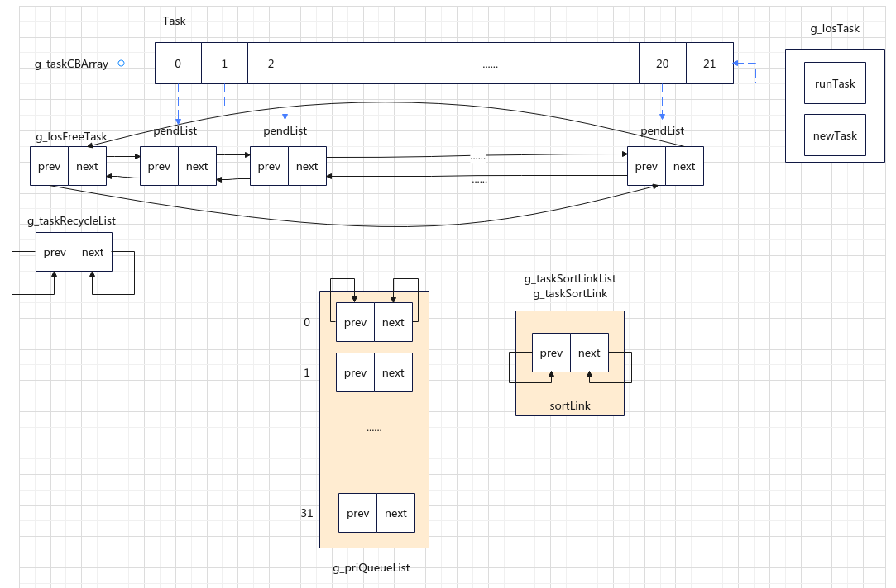
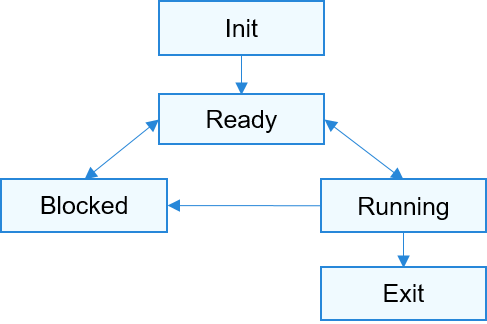
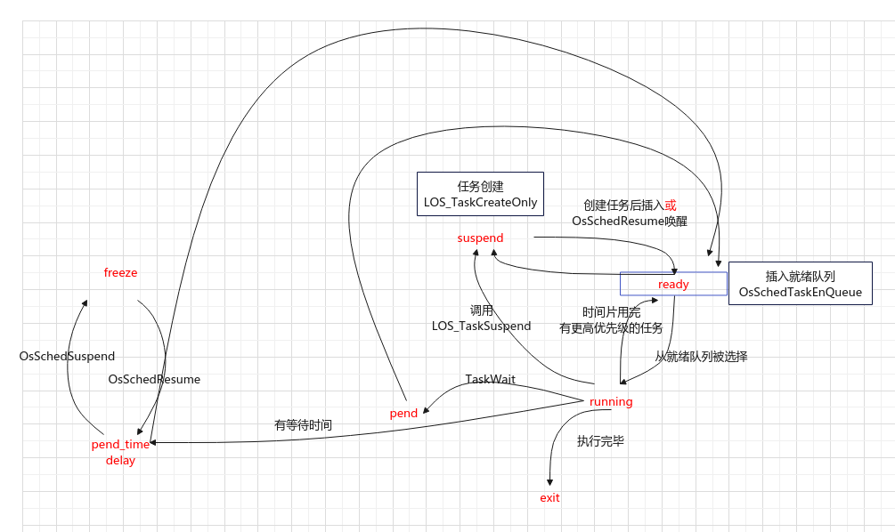
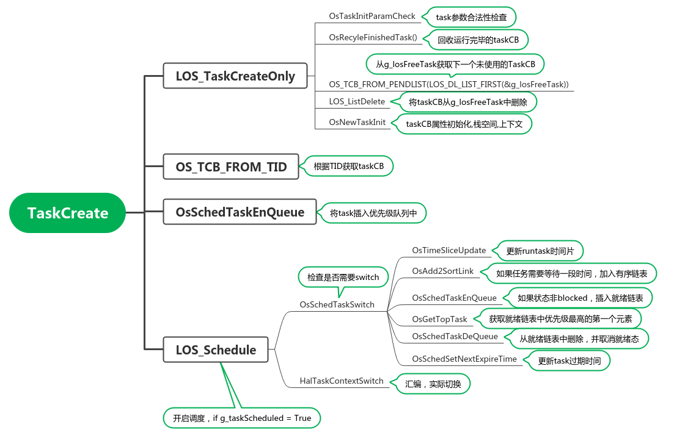
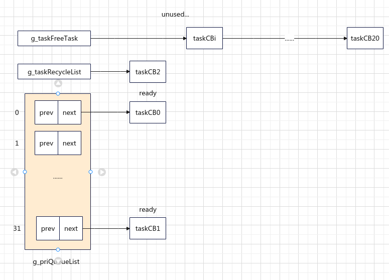
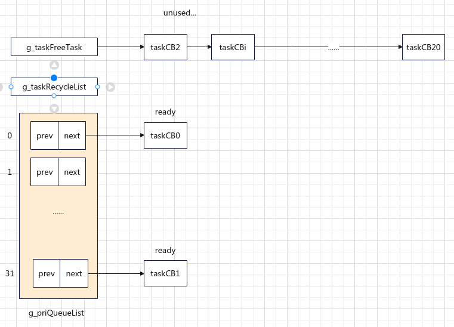
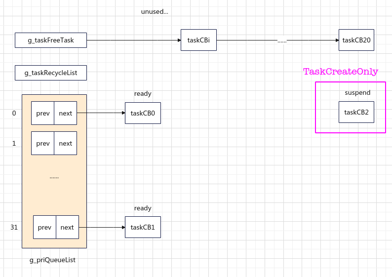
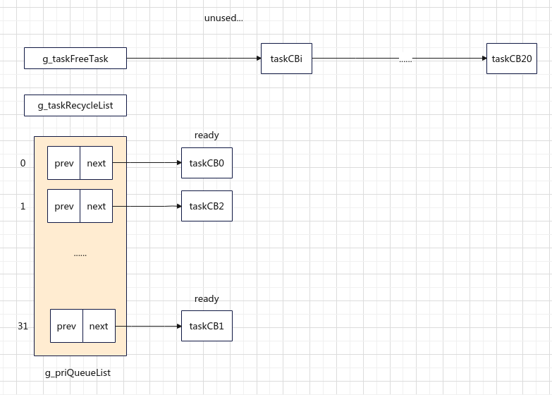

任务相关的变量定义、结构体定义，函数定义基本上都在`kernel/include/los_task.h`和`kernel/include/los_task.c`文件中

# 任务控制块 TCB

liteos使用TCB(Task control block)来描述和管理任务

```c
// kernel/include/los_task.h

/**
 * @ingroup los_task
 * Define the task control block structure.
 */
typedef struct {
    VOID                        *stackPointer;            /**< Task stack pointer */
    UINT16                      taskStatus;               /**任务状态*/
    UINT16                      priority;                 /**任务优先级*/
    INT32                       timeSlice;                /**任务时间片*/
    UINT32                      waitTimes;kernel/include/los_task.h
    SortLinkList                sortList;
    UINT64                      startTime;
    UINT32                      stackSize;                /**< Task stack size */
    UINT32                      topOfStack;               /**< Task stack top */
    UINT32                      taskID;                   /**< Task ID */
    TSK_ENTRY_FUNC              taskEntry;                /**< Task entrance function */
    VOID                        *taskSem;                 /**< Task-held semaphore */
    VOID                        *taskMux;                 /**< Task-held mutex */
    UINT32                      arg;                      /**< Parameter */
    CHAR                        *taskName;                /**< Task name */
    LOS_DL_LIST                 pendList;
    LOS_DL_LIST                 timerList;
    LOS_DL_LIST                 joinList;
    UINTPTR                     joinRetval;               /**< Return value of the end of the task, If the task does not exit by itself, the ID of the task that killed the task is recorded. */
    EVENT_CB_S                  event;
    UINT32                      eventMask;                /**< Event mask */
    UINT32                      eventMode;                /**< Event mode */
    VOID                        *msg;                     /**< Memory allocated to queues */
    INT32                       errorNo;
#if (LOSCFG_KERNEL_SIGNAL == 1)
    VOID                        *sig;                     /**< Task signal */
#endif
    LOSCFG_TASK_STRUCT_EXTENSION                          /**< Task extension field */
} LosTaskCB;
```

# 初始化

初始化主要涉及的函数有两个，分别是`OsTaskInit`和`OsSchedInit`

```c
LITE_OS_SEC_TEXT_INIT UINT32 OsTaskInit(VOID)
{/Extend/workspace/doc-wikis/liteos-m/
    UINT32 size;
    UINT32 index;

    // g_taskMaxNum = LOSCFG_BASE_CORE_TSK_LIMIT + 1 = 21
    // kernel/src/los_init.c   OsRegister(VOID)
    size = (g_taskMaxNum + 1) * sizeof(LosTaskCB);  
    g_taskCBArray = (LosTaskCB *)LOS_MemAlloc(m_aucSysMem0, size);
    if (g_taskCBArray == NULL) {
        return LOS_ERRNO_TSK_NO_MEMORY;
    }

    // Ignore the return code when matching CSEC rule 6.6(1).
    // 初始化 g_taskCBArray 空间为 0 值
    (VOID)memset_s(g_taskCBArray, size, 0, size);

    // 初始化g_losFreeTask 和 g_taskRecycleList
    LOS_ListInit(&g_losFreeTask);  // 未使用的taskCB
    LOS_ListInit(&g_taskRecycleList); // 需要回收的taskCB

    // 初始化 任务数组中的元素[0:20]，status为 未使用，taskid为index
    // 将 pendList 使用尾插法插入 g_losFreeTask 
    for (index = 0; index <= LOSCFG_BASE_CORE_TSK_LIMIT; index++) {
        g_taskCBArray[index].taskStatus = OS_TASK_STATUS_UNUSED;
        g_taskCBArray[index].taskID = index;
        LOS_ListTailInsert(&g_losFreeTask, &g_taskCBArray[index].pendList);
    }

    // Ignore the return code when matching CSEC rule 6.6(4).
    /**
     * typedef struct {
     *      LosTaskCB   *runTask;
     *      LosTaskCB   *newTask;
     *   } LosTask;
     */
    // g_losTask.runTask 指向 任务数组的最后一个元素（0值），优先级设为最低 32
    (VOID)memset_s((VOID *)(&g_losTask), sizeof(g_losTask), 0, sizeof(g_losTask));
    g_losTask.runTask = &g_taskCBArray[g_taskMaxNum];
    g_losTask.runTask->taskID = index; //index = 21
    g_losTask.runTask->taskStatus = (OS_TASK_STATUS_UNUSED | OS_TASK_STATUS_RUNNING);
    g_losTask.runTask->priority = OS_TASK_PRIORITY_LOWEST + 1;
    
    g_idleTaskID = OS_INVALID; // (UINT32)(-1)
    // 任务调度初始化
    return OsSchedInit();
}

UINT32 OsSchedInit(VOID)
{
    UINT16 pri;
    // 初始化每一个双向链表，前向后向指针均指向本身
    for (pri = 0; pri < OS_PRIORITY_QUEUE_NUM; pri++) {
        LOS_ListInit(&g_priQueueList[pri]);
    }
    g_queueBitmap = 0;

    // g_taskSortLinkList 中只有一个成员 LOS_DL_LIST sortLink;
    g_taskSortLinkList = OsGetSortLinkAttribute(OS_SORT_LINK_TASK);
    if (g_taskSortLinkList == NULL) {
        return LOS_NOK;
    }

    // 初始化成员 sortLink
    OsSortLinkInit(g_taskSortLinkList);
    // 设置 g_schedResponseTime 为 ((UINT64)-1)
    g_schedResponseTime = OS_SCHED_MAX_RESPONSE_TIME;

    return LOS_OK;
}
```

观察上面的代码，初始化涉及的全局变量包括：

1. g_taskMaxNum = 21

2. g_taskCBArray：任务数组，长度为22

3. g_losFreeTask：连接任务数组中每个元素的pendList，将前21个task串到一个双链表上。存放为使用的taskCB

4. g_taskRecycleList：初始化prev,next均指向本身，用于执行结束的task的垃圾回收。存放需要回收的taskCB

5. g_losTask：包含两个任务指针，分别为runTask和newTask，分别表示正在执行的Task和将要切换的task

6. g_idleTaskID = (UINT32)(-1)，在idletask创建后表示idletask的id。

7. g_priQueueList：任务优先级队列数组，共32个优先级，存放就绪态的task

8. g_queueBitmap = 0：用于指示哪条优先级队列中非空

9. g_taskSortLinkList = g_taskSortLink；包含了一个名为sortLink的双链表节点对象（有序链表），初始化。存放需要等待一段时间的task，该链表会在时钟中断的时候被处理。

10. g_schedResponseTime = (UINT32)(-1)

    

下面用一张图，直观的看一下初始化完成了什么：




## 任务数组、优先级队列

### 任务数组

任务数组定义为：

```c
LITE_OS_SEC_BSS  LosTaskCB                           *g_taskCBArray = NULL;
```

任务数组会在`OsTaskInit`函数(`kernel/include/los_task.c`)中进行初始化，下面给出初始化的代码片段

```c
    size = (g_taskMaxNum + 1) * sizeof(LosTaskCB);
    g_taskCBArray = (LosTaskCB *)LOS_MemAlloc(m_aucSysMem0, size);
    if (g_taskCBArray == NULL) {
        return LOS_ERRNO_TSK_NO_MEMORY;
    }

    // Ignore the return code when matching CSEC rule 6.6(1).
    (VOID)memset_s(g_taskCBArray, size, 0, size);
```

其中`g_taskMaxNum`初始化在`OsRegister`函数(`kernel/src/los_init.c`)中完成，`g_taskMaxNum=21`即数组 长度为21，内存申请成功后，将`g_taskMaxNum`内存区域初始化为0。


### 优先级队列

任务优先级队列定义为：

```c
STATIC LOS_DL_LIST g_priQueueList[OS_PRIORITY_QUEUE_NUM];
```

`OS_PRIORITY_QUEUE_NUM`为32,即g_priQueueList是一个长度为32的数组，数组的每个元素都是一个LOS_DL_LIST对象，liteos-m共管理32种优先级，0为最高优先级，31为最低优先级。

优先级队列的初始化由`OsSchedInit`函数(`kernel/src/los_sched.c`)完成，而`OsSchedInit`函数又由`OsTaskInit`进行调用，即==任务数组先进行初始化，再进行优先级队列初始化==

```c
UINT32 OsSchedInit(VOID)
{
    UINT16 pri;
    // 初始化每一个双向链表，前向后向指针均指向本身
    for (pri = 0; pri < OS_PRIORITY_QUEUE_NUM; pri++) {
        LOS_ListInit(&g_priQueueList[pri]);
    }
    g_queueBitmap = 0;

    // g_taskSortLinkList 中只有一个成员 LOS_DL_LIST sortLink;
    g_taskSortLinkList = OsGetSortLinkAttribute(OS_SORT_LINK_TASK);
    if (g_taskSortLinkList == NULL) {
        return LOS_NOK;
    }

    // 初始化成员 sortLink
    OsSortLinkInit(g_taskSortLinkList);
    // 设置 g_schedResponseTime 为 ((UINT64)-1)
    g_schedResponseTime = OS_SCHED_MAX_RESPONSE_TIME;

    return LOS_OK;
}
```

`g_queueBitmap`初始化为0

`g_taskSortLinkList` TODO

`g_schedResponseTime` TODO

# 任务管理

## 任务状态



```c
   if (taskStatus & OS_TASK_STATUS_RUNNING) {
        return (UINT8 *)"Running";
    } else if (taskStatus & OS_TASK_STATUS_READY) {
        return (UINT8 *)"Ready";
    } else if (taskStatus & OS_TASK_STATUS_EXIT) {
        return (UINT8 *)"Exit";
    } else if (taskStatus & OS_TASK_STATUS_SUSPEND) {
        return (UINT8 *)"Suspend";
    } else if (taskStatus & OS_TASK_STATUS_DELAY) {
        return (UINT8 *)"Delay";
    } else if (taskStag_taskSortLinktus & OS_TASK_STATUS_PEND) {
        if (taskStatus & OS_TASK_STATUS_PEND_TIME) {
            return (UINT8 *)"PendTime";
        }
        return (UINT8 *)"Pend";
    }
```


### 状态转换



**任务状态迁移说明：**


- 就绪态→运行态

  任务创建后进入就绪态，发生任务切换时，就绪队列中最高优先级的任务被执行，从而进入运行态，同时该任务从就绪队列中移出。

- 运行态→阻塞态

  正在运行的任务发生阻塞（挂起、延时、读信号量等）时，将该任务插入到对应的阻塞队列中，任务状态由运行态变成阻塞态，然后发生任务切换，运行就绪队列中最高优先级任务。

- 阻塞态→就绪态（阻塞态→运行态）

  阻塞的任务被恢复后（任务恢复、延时时间超时、读信号量超时或读到信号量等），此时被恢复的任务会被加入就绪队列，从而由阻塞态变成就绪态；此时如果被恢复任务的优先级高于正在运行任务的优先级，则会发生任务切换，该任务由就绪态变成运行态。

- 就绪态→阻塞态

  任务也有可能在就绪态时被阻塞（挂起），此时任务状态由就绪态变为阻塞态，该任务从就绪队列中删除，不会参与任务调度，直到该任务被恢复。

- 运行态→就绪态

  有更高优先级任务创建或者恢复后，会发生任务调度，此刻就绪队列中最高优先级任务变为运行态，那么原先运行的任务由运行态变为就绪态，依然在就绪队列中。

- 运行态→退出态

  运行中的任务运行结束，任务状态由运行态变为退出态。退出态包含任务运行结束的正常退出状态以及Invalid状态。例如，任务运行结束但是没有自删除，对外呈现的就是Invalid状态，即退出态。

- 阻塞态→退出态

  阻塞的任务调用删除接口，任务状态由阻塞态变为退出态。


## 创建任务



创建任务使用的函数为：

```c

/*****************************************************************************
 Function    : LOS_TaskCreate
 Description : Create a task
 Input       : taskInitParam --- Task init parameters
 Output      : taskID        --- Save task ID
 Return      : LOS_OK on success or error code on failure
 *****************************************************************************/
LITE_OS_SEC_TEXT_INIT UINT32 LOS_TaskCreate(UINT32 *taskID, TSK_INIT_PARAM_S *taskInitParam);
```

**该函数的作用是：**

1. 调用LOS_TaskCreateOnly创建一个task
2. 根据taskID从任务数组中获取该任务
3. 根据task的优先级插入相应的优先级队列中
4. 如果g_taskScheduled为True开启调度


输入的参数是两个指针，taskID会根据分配的任务数组的下标进行赋值

`TSK_INIT_PARAM_S`定义如下：

```c
/**
 * @ingroup los_task
 * Define the structure of the parameters used for task creation.
 *
 * Information of specified parameters passed in during task creation.
 */
typedef struct tagTskInitParam {
    TSK_ENTRY_FUNC       pfnTaskEntry;              /**< Task entrance function                 */
    UINT16               usTaskPrio;                /**< Task priority                          */
    UINT32               uwArg;                     /**< Task parameters                        */
    UINTPTR              stackAddr;                 /**< Task satck memory                      */
    UINT32               uwStackSize;               /**< Task stack size                        */
    CHAR                 *pcName;                   /**< Task name                              */
    UINT32               uwResved;                  /**< Reserved                               */
} TSK_INIT_PARAM_S;
```

创建任务具体流程：

```c
LITE_OS_SEC_TEXT_INIT UINT32 LOS_TaskCreate(UINT32 *taskID, TSK_INIT_PARAM_S *taskInitParam)
{
    UINT32 retVal;
 OS_TASK_STATUS_PEND_TIME   UINT32 intSave;
    LosTaskCB *taskCB = NULL;

    retVal = LOS_TaskCreateOnly(taskID, taskInitParam);  // Create a task and suspend
    if (retVal != LOS_OK) {
        return retVal;
    }
    taskCB = OS_TCB_FROM_TID(*taskID); // 根据taskID从任务数组中获取该任务

    intSave = LOS_IntLock();
    
    // 将task插入优先级队列中
    OsSchedTaskEnQueue(taskCB);
    LOS_IntRestore(intSave);

    // 如果g_taskScheduled为True开启调度
    if (g_taskScheduled) {
        LOS_Schedule();
    }

    return LOS_OK;
}
```

LOS_TaskCreateOnly定义为：

```c
LITE_OS_SEC_TEXT_INIT UINT32 LOS_TaskCreateOnly(UINT32 *taskID, TSK_INIT_PARAM_S *taskInitParam)
{
    UINT32 intSave;
    LosTaskCB *taskCB = NULL;
    UINT32 retVal;

    if (taskID == NULL) {
        return LOS_ERRNO_TSK_ID_INVALID;
    }

    retVal = OsTaskInitParamCheck(taskInitParam); // 检查参数是否合法
    if (retVal != LOS_OK) {
        return retVal;
    }

    // 回收运行结束的Task
    OsRecyleFinishedTask();

    intSave = LOS_IntLock();
    // 如果g_losFreeTask为空，解锁，返回
    if (LOS_ListEmpty(&g_losFreeTask)) {
        LOS_IntRestore(intSave);
        return LOS_ERRNO_TSK_TCB_UNAVAILABLE;
    }

    // 从g_losFreeTask中选择第一个元素,并获取指向任务控制块的指针。
    taskCB = OS_TCB_FROM_PENDLIST(LOS_DL_LIST_FIRST(&g_losFreeTask));
    // 从g_losFreeTask删除第一个元素LOS_KernelInit
    LOS_ListDelete(LOS_DL_LIST_FIRST(&g_losFreeTask));
    // 解锁
    LOS_IntRestore(intSave);

    // 这个函数比较重要，给task成员赋初值，设置栈等
    retVal = OsNewTaskInit(taskCB, taskInitParam);
    if (retVal != LOS_OK) {
        // 如果失败，把task加入g_losFreeTask链表，释放task
        intSave = LOS_IntLock();
        OsInsertTCBToFreeList(taskCB);
        LOS_IntRestore(intSave);
        return retVal;
    }

    LOSCFG_TASK_CREATE_EXTENSION_HOOK(taskCB);

    // 传入的taskID会被taskCB->taskID赋值
    *taskID = taskCB->taskID;
    OsHookCall(LOS_HOOK_TYPE_TASK_CREATE, taskCB);
    return retVal;
}
```

1. 首先对taskInitParam的参数是否合法进行检查，11行
2. 回收运行结束的Task，运行结束的task会连接在g_taskRecycleList链表上，17行
3. 如果g_losFreeTask为空，表示所有的任务数组均被使用，不能创建新的task，返回，即最多有21个任务。21行
4. 如果g_losFreeTask非空，则从链表中选择第一个元素，讲该元素从g_losFreeTask删除。27,29行
5. 为taskCB的成员赋初值，并根据栈大小设置栈。34行
6. 如果第5步失败，则将task插入g_losFreeTask，并释放空间，使得该taskCB可被重新分配。38行

### 参数合法性检查-OsTaskInitParamCheck

`OsTaskInitParamCheck`负责对taskInitParam的参数合法性进行检查，其中需要说明的是优先级和栈大小的检查：

1. 优先级的范围是[0:31]，31是最低优先级，最低优先级的task有且只能有一个，是系统默认的task`OsIdleTask`，在内核初始化（LOS_KernelInit）时进行创建。
2. 栈大小范围是[0x130:0x10000]，如果栈大小为0,则赋值一个默认栈大小0x2d0

```c
    // 优先级的范围是[0:31]，31是最低优先级，超过31非法
    if ((taskInitParam->usTaskPrio) > OS_TASK_PRIORITY_LOWEST) {
        return LOS_ERRNO_TSK_PRIOR_ERROR;
    }

    // 如果优先级是最低优先级31,且task的执行函数不是 OsIdleTask，非法
    // 即,系统中只能有一个最低优先级的任务，且必须是 OsIdleTask（该task在内核初始化时创建）
    if (((taskInitParam->usTaskPrio) == OS_TASK_PRIORITY_LOWEST)
        && (taskInitParam->pfnTaskEntry != OS_IDLE_TASK_ENTRY)) {
        return LOS_ERRNO_TSK_PRIOR_ERROR;
    }

    // 栈太大，非法
    if (taskInitParam->uwStackSize > LOSCFG_SYS_HEAP_SIZE) {
        return LOS_ERRNO_TSK_STKSZ_TOO_LARGE;
    }

    // 如果栈大小为0,给一个默认的栈大小，0x2d0
    if (taskInitParam->uwStackSize == 0) {
        taskInitParam->uwStackSize = LOSCFG_BASE_CORE_TSK_DEFAULT_STACK_SIZE;
    }

    // 栈太小，非法，合法栈大小在[0x130:0x10000]
    if (taskInitParam->uwStackSize < LOSCFG_BASE_CORE_TSK_MIN_STACK_SIZE) {
        return LOS_ERRNO_TSK_STKSZ_TOO_SMALL;
    }
```

### 回收运行结束的Task-OsRecyleFinishedTask

```c
STATIC VOID OsRecyleFinishedTask(VOID)
{
    LosTaskCB *taskCB = NULL;
    UINT32 intSave;
    UINTPTR stackPtr;

    intSave = LOS_IntLock();
    while (!LOS_ListEmpty(&g_taskRecycleList)) {  // 当g_taskRecycleList非空
        // 从 g_taskRecycleList 链表中取出第一个元素，并获取指向任务控制块的指针。
        taskCB = OS_TCB_FROM_PENDLIST(LOS_DL_LIST_FIRST(&g_taskRecycleList));
        // 删除第一个元素
        LOS_ListDelete(LOS_DL_LIST_FIRST(&g_taskRecycleList));
        stackPtr = 0;
        // 释放task占用的栈空间
        OsRecycleTaskResources(taskCB, &stackPtr); 
        LOS_IntRestore(intSave);

        (VOID)LOS_MemFree(OS_TASK_STACK_ADDR, (VOID *)stackPtr);
        intSave = LOS_IntLock();
    }
    LOS_IntRestore(intSave);
}
```

该函数对`g_taskRecycleList`进行遍历，如果链表非空，则取链表第一个元素，将该元素从链表中删除，

`g_taskRecycleList`插入时机： `OsRunningTaskDelete`删除task时被插入

### 初始化task-OsNewTaskInit

该函数使用`taskInitParam`给taskCB对象初始化，根据栈大小，在内存中申请空间作为task的栈，在栈中存放上下文对象context，并初始化。

在设置上下文(`ArchTskStackInit`)的时候，会对上下文的pc指针赋值

```c
 context->mepc = (UINT32)(UINTPTR)OsTaskEntry;
```

`OsTaskEntry`会对task要执行的任务函数进行封装，使得任务函数执行完毕后执行task删除，释放taskCB

```c
LITE_OS_SEC_TEXT_INIT VOID OsTaskEntry(UINT32 taskID)
{
    UINT32 retVal;
    LosTaskCB *taskCB = OS_TCB_FROM_TID(taskID);

    // 执行task的函数
    taskCB->joinRetval = (UINTPTR)taskCB->taskEntry(taskCB->arg);
    // task函数执行完毕后，task会被删除
    retVal = LOS_TaskDelete(taskCB->taskID);
    if (retVal != LOS_OK) {
        PRINT_ERR("Delete Task[TID: %d] Failed!\n", taskCB->taskID);
    }
}
```


### 涉及的链表变化

假设新创建的task优先级为1

**假设在创建task前：**

1. `g_taskRecycleList`中有一个task，taskid为2
2. `g_losFreeTask`下一个节点下标为i
3. `OsIdleTask`taskid为1，且暂未运行（未对执行完毕的task进行回收）



**注： 上图是一个示意图，实际的链表并不直接连接taskCB，链表是双向循环链表**


那么，在创建task时：

1. 首先对`g_taskRecycleList`进行回收，将taskCB从`g_taskRecycleList`中删除，并使用头插法，将taskCB插入到`g_losFreeTask`链表中，此时`g_losFreeTask`下一个节点为g_taskCBArray[2]
2. 从`g_losFreeTask`获取第一个节点，即g_taskCBArray[2]，将该节点从`g_losFreeTask`删除，`g_losFreeTask`下一个节点下标为i
3. 将task插入到`g_priQueueList[1]`中









**注： 上图是示意图，实际的链表并不直接连接taskCB，链表是双向循环链表**

### task状态

新创建的task状态为`suspend`，OsNewTaskInit函数

插入到优先级队列后状态变为`ready`,OsSchedTaskEnQueue函数

## 获取任务

## 删除任务


## 任务切换


# 系统task

系统task拥有一些特殊的性质：

1. 在内核初始化(`LOS_KernelInit`)时被创建
2. 不允许进入suspend状态
3. 不允许delay
4. 不可以被删除
5. 不可以修改优先级

## software timer

```c
LITE_OS_SEC_TEXT_INIT UINT32 OsSwtmrTaskCreate(VOID)
{
    UINT32 ret;
    TSK_INIT_PARAM_S swtmrTask;

    // Ignore the return code when matching CSEC rule 6.6(4).
    (VOID)memset_s(&swtmrTask, sizeof(TSK_INIT_PARAM_S), 0, sizeof(TSK_INIT_PARAM_S));

    swtmrTask.pfnTaskEntry    = (TSK_ENTRY_FUNC)OsSwtmrTask;
    swtmrTask.uwStackSize     = LOSCFG_BASE_CORE_TSK_SWTMR_STACK_SIZE;
    swtmrTask.pcName          = "Swt_Task";
    swtmrTask.usTaskPrio      = 0;
    ret = LOS_TaskCreate(&g_swtmrTaskID, &swtmrTask);
    if (ret == LOS_OK) {
        OS_TCB_FROM_TID(g_swtmrTaskID)->taskStatus |= OS_TASK_FLAG_SYSTEM_TASK;
    }
    return ret;
}
```

timer优先级为0,最高优先级

调试时发现该任务大部分时间处于PEND状态

## IdelTask

```c
LITE_OS_SEC_TEXT_INIT UINT32 OsIdleTaskCreate(VOID)
{
    UINT32 retVal;
    TSK_INIT_PARAM_S taskInitParam;
    // Ignore the return code when matching CSEC rule 6.6(4).
    (VOID)memset_s((VOID *)(&taskInitParam), sizeof(TSK_INIT_PARAM_S), 0, sizeof(TSK_INIT_PARAM_S));
    taskInitParam.pfnTaskEntry = (TSK_ENTRY_FUNC)OsIdleTask;
    taskInitParam.uwStackSize = LOSCFG_BASE_CORE_TSK_IDLE_STACK_SIZE;
    taskInitParam.pcName = "IdleCore000";
    taskInitParam.usTaskPrio = OS_TASK_PRIORITY_LOWEST;
    retVal = LOS_TaskCreateOnly(&g_idleTaskID, &taskInitParam);
    if (retVal != LOS_OK) {
        return retVal;
    }

    OsSchedSetIdleTaskSchedParam(OS_TCB_FROM_TID(g_idleTaskID));
    return LOS_OK;
}
```

IdelTask优先级为31,最低优先级，IdelTask的功能是：回收执行完毕的task，如果PmEnter非空，则执行PmEnter，否则sleep

```c
LITE_OS_SEC_TEXT VOID OsIdleTask(VOID)
{
    while (1) {
        // 回收执行完毕的task
        OsRecyleFinishedTask();
        
        // 如果PmEnter非空，则执行PmEnter，否则sleep
        if (PmEnter != NULL) {
            PmEnter();
        } else {
            (VOID)ArchEnterSleep();
        }
    }
}
```


