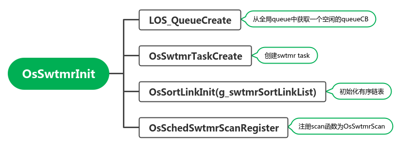
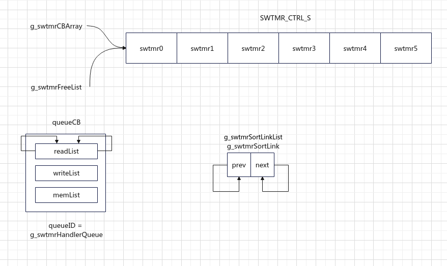

# timer

## 硬件时钟初始化

```c
// kernel/src/los_tick.c
LITE_OS_SEC_TEXT_INIT UINT32 OsTickTimerInit(VOID)
{
    UINT32 ret;
    UINT32 intSave;

    // 注册中断处理函数 tickHandler = LOS_SchedTickHandler
    HWI_PROC_FUNC tickHandler = (HWI_PROC_FUNC)OsTickHandler;

    // g_sysTickTimer = g_archTickTimer
    g_sysTickTimer = LOS_SysTickTimerGet();
    if ((g_sysTickTimer->init == NULL) || (g_sysTickTimer->reload == NULL) ||
        (g_sysTickTimer->lock == NULL) || (g_sysTickTimer->unlock == NULL) ||
        (g_sysTickTimer->getCycle == NULL)) {
        return LOS_ERRNO_SYS_HOOK_IS_NULL;
    }

    if (g_sysTickTimer->tickHandler != NULL) {
        tickHandler = g_sysTickTimer->tickHandler;
    }

    intSave = LOS_IntLock();
    // 修改g_hwiForm，注册中断处理函数
    ret = g_sysTickTimer->init(tickHandler);
    if (ret != LOS_OK) {
        LOS_IntRestore(intSave);
        return ret;
    }

    if ((g_sysTickTimer->freq == 0) || (g_sysTickTimer->freq < LOSCFG_BASE_CORE_TICK_PER_SECOND)) {
        LOS_IntRestore(intSave);
        return LOS_ERRNO_SYS_CLOCK_INVALID;
    }

    if (g_sysTickTimer->irqNum > (INT32)LOSCFG_PLATFORM_HWI_LIMIT) {
        LOS_IntRestore(intSave);
        return LOS_ERRNO_TICK_CFG_INVALID;
    }

    g_sysClock = g_sysTickTimer->freq;
    g_cyclesPerTick = g_sysTickTimer->freq / LOSCFG_BASE_CORE_TICK_PER_SECOND;
    g_sysTimerIsInit = TRUE;

    LOS_IntRestore(intSave);

    return LOS_OK;
}
```


## 软件时钟初始化



QueueCB涉及到另一个重要内容，详见[7.liteos-m源码分析 - queue](./liteos-m-source-queue.md).

```c
LITE_OS_SEC_TEXT_INIT UINT32 OsSwtmrInit(VOID)
{
    UINT32 size;
    UINT16 index;
    UINT32 ret;

#if (LOSCFG_BASE_CORE_SWTMR_ALIGN == 1)
    // Ignore the return code when matching CSEC rule 6.6(1).
    // g_swtmrAlignID初始化为0值
    (VOID)memset_s((VOID *)g_swtmrAlignID, sizeof(SwtmrAlignData) * LOSCFG_BASE_CORE_SWTMR_LIMIT,
                   0, sizeof(SwtmrAlignData) * LOSCFG_BASE_CORE_SWTMR_LIMIT);
#endif

    size = sizeof(SWTMR_CTRL_S) * LOSCFG_BASE_CORE_SWTMR_LIMIT;
    // 为swtmr 申请空间，6个结构体大小的空间，最多维护6个timer
    SWTMR_CTRL_S *swtmr = (SWTMR_CTRL_S *)LOS_MemAlloc(m_aucSysMem0, size);
    if (swtmr == NULL) {
        return LOS_ERRNO_SWTMR_NO_MEMORY;
    }
    // Ignore the return code when matching CSEC rule 6.6(3).
    // 初始化为0值
    (VOID)memset_s((VOID *)swtmr, size, 0, size);
    g_swtmrCBArray = swtmr;
    g_swtmrFreeList = swtmr;
    swtmr->usTimerID = 0;
    SWTMR_CTRL_S *temp = swtmr;
    // 按数组的形式给swtmr中的6个元素赋值，并使用pstNext指针串联成单链表
    swtmr++;
    for (index = 1; index < LOSCFG_BASE_CORE_SWTMR_LIMIT; index++, swtmr++) {
        swtmr->usTimerID = index;
        temp->pstNext = swtmr;
        temp = swtmr;
    }

    // 初始化1个队列，队列中的包含一个读链表和一个写链表，g_swtmrHandlerQueue记录队列的ID
    ret = LOS_QueueCreate((CHAR *)NULL, OS_SWTMR_HANDLE_QUEUE_SIZE,
                          &g_swtmrHandlerQueue, 0, sizeof(SwtmrHandlerItem));
    if (ret != LOS_OK) {
        (VOID)LOS_MemFree(m_aucSysMem0, swtmr);
        return LOS_ERRNO_SWTMR_QUEUE_CREATE_FAILED;
    }

    ret = OsSwtmrTaskCreate();
    if (ret != LOS_OK) {
        (VOID)LOS_MemFree(m_aucSysMem0, swtmr);
        return LOS_ERRNO_SWTMR_TASK_CREATE_FAILED;
    }

    // g_swtmrSortLinkList = g_swtmrSortLink
    g_swtmrSortLinkList = OsGetSortLinkAttribute(OS_SORT_LINK_SWTMR);
    if (g_swtmrSortLinkList == NULL) {
        (VOID)LOS_MemFree(m_aucSysMem0, swtmr);
        return LOS_NOK;
    }

    ret = OsSortLinkInit(g_swtmrSortLinkList);
    if (ret != LOS_OK) {
        (VOID)LOS_MemFree(m_aucSysMem0, swtmr);
        return LOS_NOK;
    }

    ret = OsSchedSwtmrScanRegister((SchedScan)OsSwtmrScan);
    if (ret != LOS_OK) {
        (VOID)LOS_MemFree(m_aucSysMem0, swtmr);
        return LOS_NOK;
    }

    return LOS_OK;
}
```

下面用一张图直观的展示初始化对什么数据结构进行了初始化



1. 在16行，申请了一块名为`swtmr`,大小为`SWTMR_CTRL_S * 6`的空间，表示有6个软件timer
2. 23行，24行，使全局变量`g_swtmrCBArray`和`g_swtmrFreeList`均指向`swtmr`的地址
3. 22-33行，对`swtmr`内存区域进行初始化，每个元素的id是他们在数组中的下标；同时使用next指针将他们串联成为单链表
4. 36行，从全局queue`g_freeQueueList`中获取一个空闲的块，对其进行初始化，初始化readList,writeList和memList，其中readList和witeList长度为6，并根据queueCB的ID对`g_swtmrHandlerQueue`赋值
5. 43行，创建Swtmr Task
6. 50行，g_swtmrSortLinkList = g_swtmrSortLink
7. 56行，初始化有序链表g_swtmrSortLinkList
8. 62行，注册scan函数，g_swtmrScan = OsSwtmrScan


# 硬件时钟中断

## 时钟中断处理

```c
/**
 * @brief 时钟中断处理函数
 * 
 * @return VOID 
 */
VOID LOS_SchedTickHandler(VOID)
{   
    // 如果g_taskScheduled = Fasle，返回
    if (!g_taskScheduled) {
        return;
    }

    UINT32 intSave = LOS_IntLock();
    UINT64 tickStartTime = OsGetCurrSchedTimeCycle();
    if (g_schedResponseID == OS_INVALID) {
        g_tickIntLock++;
        if (g_swtmrScan != NULL) {
            // 调用软件timer的scan函数
            (VOID)g_swtmrScan();
        }
        // 检查sortlist，处理超时的任务
        (VOID)OsSchedScanTimerList();
        g_tickIntLock--;
    }

    // 更新runtask的时间片
    OsTimeSliceUpdate(g_losTask.runTask, tickStartTime);
    g_losTask.runTask->startTime = OsGetCurrSchedTimeCycle();

    g_schedResponseTime = OS_SCHED_MAX_RESPONSE_TIME;
    if (LOS_CHECK_SCHEDULE) {
        ArchTaskSchedule();
    } else {
        OsSchedUpdateExpireTime();
    }

    LOS_IntRestore(intSave);
}
```


每次时钟中断，都会检查sortlist，把其中超时的任务从链表中删除，并加入到就绪队列

```c
STATIC INLINE BOOL OsSchedScanTimerList(VOID)
{
    BOOL needSchedule = FALSE;
    LOS_DL_LIST *listObject = &g_taskSortLinkList->sortLink;
    /*
     * When task is pended with timeout, the task block is on the timeout sortlink
     * (per cpu) and ipc(mutex,sem and etc.)'s block at the same time, it can be waken
     * up by either timeout or corresponding ipc it's waiting.
     *
     * Now synchronize sortlink procedure is used, therefore the whole task scan needs
     * to be protected, preventing another core from doing sortlink deletion at same time.
     */

    if (LOS_ListEmpty(listObject)) {
        return needSchedule;
    }

    SortLinkList *sortList = LOS_DL_LIST_ENTRY(listObject->pstNext, SortLinkList, sortLinkNode);
    UINT64 currTime = OsGetCurrSchedTimeCycle();
    // 遍历链表直到sortList->responseTime > 当前时间，从sortlist中删除，并添加到就绪队列中
    while (sortList->responseTime <= currTime) {
        LosTaskCB *taskCB = LOS_DL_LIST_ENTRY(sortList, LosTaskCB, sortList);
        OsDeleteNodeSortLink(&taskCB->sortList);
        OsSchedWakePendTimeTask(taskCB, &needSchedule);
        if (LOS_ListEmpty(listObject)) {
            break;
        }

        sortList = LOS_DL_LIST_ENTRY(listObject->pstNext, SortLinkList, sortLinkNode);
    }

    return needSchedule;
}
```

# 软件时钟

## 软件时钟创建

```c
LITE_OS_SEC_TEXT_INIT UINT32 LOS_SwtmrCreate(UINT32 interval,
                                             UINT8 mode,
                                             SWTMR_PROC_FUNC handler,
                                             UINT32 *swtmrId,
                                             UINT32 arg,
                                             UINT8 rouses,
                                             UINT8 sensitive)
```

该函数从`g_swtmrFreeList`中获取一个空闲的`swtmr`，使用参数对其赋值

之后会调用`LOS_SwtmrStart(swtmrId)`将timer加入到g_swtmrSortLink有序链表中

## 软件时钟处理

硬件时钟中断时会调用`g_swtmrScan()`对软件timer进行scan

```c
if (g_swtmrScan != NULL) {
    // 调用软件timer的scan函数OsSchedScanTimerList
    (VOID)g_swtmrScan();
}
```

在[软件时钟初始化](##软件时钟初始化)一节中说明了g_swtmrScan = OsSwtmrScan，

```c
STATIC BOOL OsSwtmrScan(VOID)
{
    BOOL needSchedule = FALSE;
    LOS_DL_LIST *listObject = &g_swtmrSortLinkList->sortLink;

    // 如果有序链表为空，则不需要进行调度，直接返回
    if (LOS_ListEmpty(listObject)) {
        return needSchedule;
    }

    SortLinkList *sortList = LOS_DL_LIST_ENTRY(listObject->pstNext, SortLinkList, sortLinkNode);
    UINT64 currTime = OsGetCurrSchedTimeCycle();
    // 如果任务超时，将任务从sortlink上删除
    while (sortList->responseTime <= currTime) {
        SWTMR_CTRL_S *swtmr = LOS_DL_LIST_ENTRY(sortList, SWTMR_CTRL_S, stSortList);
        swtmr->startTime = GET_SORTLIST_VALUE(sortList);

        OsDeleteNodeSortLink(sortList);
        OsHookCall(LOS_HOOK_TYPE_SWTMR_EXPIRED, swtmr);
        // 对swtmr进行超时处理
        OsSwtmrTimeoutHandle(currTime, swtmr);

        needSchedule = TRUE;
        if (LOS_ListEmpty(listObject)) {
            break;
        }

        sortList = LOS_DL_LIST_ENTRY(listObject->pstNext, SortLinkList, sortLinkNode);
    }

    return needSchedule;
}
```

1. 函数对`g_swtmrSortLinkList->sortLink`有序链表进行处理，如果有序链表为空，则不需要进行调度，直接返回。 --- 7行
2. 否则，遍历有序链表，如果任务超时，--- 14行
    1. 取出`SWTMR_CTRL_S`元素，并将其从链表中删除。--- 18行
    2. 调用`OsSwtmrTimeoutHandle`函数对`swtmr`进行处理。---21行

```c
STATIC VOID OsSwtmrTimeoutHandle(UINT64 currTime, SWTMR_CTRL_S *swtmr)
{
    SwtmrHandlerItem swtmrHandler;

    // swtmr 赋值给 swtmrHandler
    swtmrHandler.handler = swtmr->pfnHandler;
    swtmrHandler.arg = swtmr->uwArg;
    swtmrHandler.swtmrID = swtmr->usTimerID;

    // 将swtmrHandler写入swtmr维护的消息队列
    (VOID)LOS_QueueWriteCopy(g_swtmrHandlerQueue, &swtmrHandler, sizeof(SwtmrHandlerItem), LOS_NO_WAIT);
    // 如果该timer是一个周期性的任务，则把该timer加入到g_swtmrSortLink有序链表中
    if (swtmr->ucMode == LOS_SWTMR_MODE_PERIOD) {
        swtmr->ucOverrun++;
        OsSwtmrStart(currTime, swtmr);
    } else if (swtmr->ucMode == LOS_SWTMR_MODE_NO_SELFDELETE) {
        swtmr->ucState = OS_SWTMR_STATUS_CREATED;
    }
}
```

