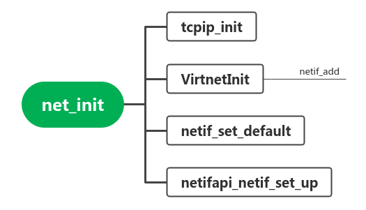

liteos-m使用lwip实现网络操作，lwip是一个轻量级的TCP/IP协议栈（Lightweight TCP/IP stack）实现，最初是瑞士计算机科学学院Adam Dunkels编写的一个应用于无操作系统的嵌入式系统中的TCP/IP协议栈，后来作为一个开源项目。

# 初始化



本代码出自`OpenHarmony/device/qemu/riscv32_virt/liteos_m/board/main.c`

`struct netif`定义在`third_party/lwip/src/include/lwip/netif.h`

```c
void net_init(void)
{	
    // OpenHarmony/third_party/lwip/src/api/tcpip.c
    extern void tcpip_init(tcpip_init_done_fn initfunc, void *arg);
    // OpenHarmony/device/qemu/riscv32_virt/liteos_m/board/driver/virtnet.c
    extern struct netif *VirtnetInit(void);

    static unsigned int overtime = 0;

    printf("tcpip_init start\n");
    tcpip_init(NULL, NULL);
    printf("tcpip_init end\n");

    printf("netif init start...\n");
    // 创建一个网络接口，返回网络接口的结构体指针
    struct netif *pnetif = VirtnetInit();
    if (pnetif) {
        netif_set_default(pnetif);
        (void)netifapi_netif_set_up(pnetif);
        do {
            LOS_UDelay(SLEEP_TIME_MS);
            overtime++;
            if (overtime > NETIF_SETUP_OVERTIME) {
                PRINT_ERR("netif_is_link_up overtime!\n");
                break;
            }
        } while (netif_is_link_up(pnetif) == 0);
        if (overtime <= NETIF_SETUP_OVERTIME) {
            printf("netif init succeed!\n");
        }
    } else {
        printf("netif init failed!\n");
    }
}
```

## tcpip_init

这个函数是lwip实现的初始化接口

在liteos-m中`sys_thread_new`是对`task_create`函数进行了封装，实际仍是创建了一个task

```c
void
tcpip_init(tcpip_init_done_fn initfunc, void *arg)
{
  lwip_init();

  tcpip_init_done = initfunc;
  tcpip_init_done_arg = arg;
  if (sys_mbox_new(&tcpip_mbox, TCPIP_MBOX_SIZE) != ERR_OK) {
    LWIP_ASSERT("failed to create tcpip_thread mbox", 0);
  }
#if LWIP_TCPIP_CORE_LOCKING
  if (sys_mutex_new(&lock_tcpip_core) != ERR_OK) {
    LWIP_ASSERT("failed to create lock_tcpip_core", 0);
  }
#endif /* LWIP_TCPIP_CORE_LOCKING */

  sys_thread_new(TCPIP_THREAD_NAME, tcpip_thread, NULL, TCPIP_THREAD_STACKSIZE, TCPIP_THREAD_PRIO);
}
```

其中tcpip_thread是lwip提供的函数,该函数读取tcpip_mbox消息队列中的消息进行处理

```c
/**
 * The main lwIP thread. This thread has exclusive access to lwIP core functions
 * (unless access to them is not locked). Other threads communicate with this
 * thread using message boxes.
 *
 * It also starts all the timers to make sure they are running in the right
 * thread context.
 *
 * @param arg unused argument
 */
static void
tcpip_thread(void *arg)
{
  struct tcpip_msg *msg;
  LWIP_UNUSED_ARG(arg);

  LWIP_MARK_TCPIP_THREAD();

  LOCK_TCPIP_CORE();
  if (tcpip_init_done != NULL) {
    tcpip_init_done(tcpip_init_done_arg);
  }

  while (1) {                          /* MAIN Loop */
    LWIP_TCPIP_THREAD_ALIVE();
    /* wait for a message, timeouts are processed while waiting */
    TCPIP_MBOX_FETCH(&tcpip_mbox, (void **)&msg);
    if (msg == NULL) {
      LWIP_DEBUGF(TCPIP_DEBUG, ("tcpip_thread: invalid message: NULL\n"));
      LWIP_ASSERT("tcpip_thread: invalid message", 0);
      continue;
    }
    tcpip_thread_handle_msg(msg);
  }
}
```


## VirtnetInit

```c
struct netif *VirtnetInit(void)
{
    ip4_addr_t ip, mask, gw;
    struct netif *netif = NULL;
	
    // 为结构体申请空间
    netif = mem_calloc(1, sizeof(struct netif));
    if (netif == NULL) {
        PRINT_ERR("alloc netif memory failed\n");
        return NULL;
    }
	
    // 设置ip/mask/gw
    ip.addr = ipaddr_addr(VIRTMMIO_NETIF_DFT_IP);
    mask.addr = ipaddr_addr(VIRTMMIO_NETIF_DFT_MASK);
    gw.addr = ipaddr_addr(VIRTMMIO_NETIF_DFT_GW);
    // 配置netif的值
    if (netif_add(netif, &ip, &mask, &gw, netif->state,
                    EthernetIfInit, tcpip_input) == NULL) {
        PRINT_ERR("add virtio-mmio net device failed\n");
        // 如果失败，释放空间
        VirtnetDeInit(netif);
        return NULL;
    }

    return netif;
}
```

其中`ipaddr_addr`和`netif_add`函数都是lwip提供的实现。

# lwip 提供的初始化步骤

A truly complete and generic sequence for initializing the lwIP stack cannot be given because it depends on additional initializations for your runtime environment (e.g. timers).

We can give you some idea on how to proceed when using the raw API. We assume a configuration using a single Ethernet netif and the UDP and TCP transport layers, IPv4 and the DHCP client.

Call these functions in the order of appearance:

- [lwip_init()](group__lwip__nosys.html#ga0c1a18439524d2f4a5e51d25c0ca2ce9): Initialize the lwIP stack and all of its subsystems.

- netif_add(struct netif *netif, ...): Adds your network interface to the netif_list. Allocate a struct netif and pass a pointer to this structure as the first argument. Give pointers to cleared ip_addr structures when using DHCP, or fill them with sane numbers otherwise. The state pointer may be NULL.

    The init function pointer must point to a initialization function for your Ethernet netif interface. The following code illustrates its use.

```c
err_t netif_if_init(struct netif *netif)
{
  u8_t i;
  
  for (i = 0; i < ETHARP_HWADDR_LEN; i++) {
    netif->hwaddr[i] = some_eth_addr[i];
  }
  init_my_eth_device();
  return ERR_OK;
}
```


For Ethernet drivers, the input function pointer must point to the lwIP function [ethernet_input()](group__lwip__nosys.html#ga6a10c58b82c56d02c48b3cfa2c2494ff) declared in "netif/etharp.h". Other drivers must use ip_input() declared in "lwip/ip.h".

- [netif_set_default(struct netif *netif)](group__netif.html#gac90f290edd005238d62aa94c4ac9dea3) Registers the default network interface.
- [netif_set_link_up(struct netif *netif)](group__netif.html#gae0d2975f189277990e9d5276fdd9e9ea) This is the hardware link state; e.g. whether cable is plugged for wired Ethernet interface. This function must be called even if you don't know the current state. Having link up and link down events is optional but DHCP and IPv6 discover benefit well from those events.
- [netif_set_up(struct netif *netif)](group__netif.html#gaf19693be401a265a52d2a56c65753121) This is the administrative (= software) state of the netif, when the netif is fully configured this function must be called.
- dhcp_start(struct netif *netif) Creates a new DHCP client for this interface on the first call. You can peek in the netif->dhcp struct for the actual DHCP status.
- [sys_check_timeouts()](group__lwip__nosys.html#ga83cffdf69ab60fd0eba9d17d363f9883) When the system is running, you have to periodically call [sys_check_timeouts()](group__lwip__nosys.html#ga83cffdf69ab60fd0eba9d17d363f9883) which will handle all timers for all protocols in the stack; add this to your main loop or equivalent.