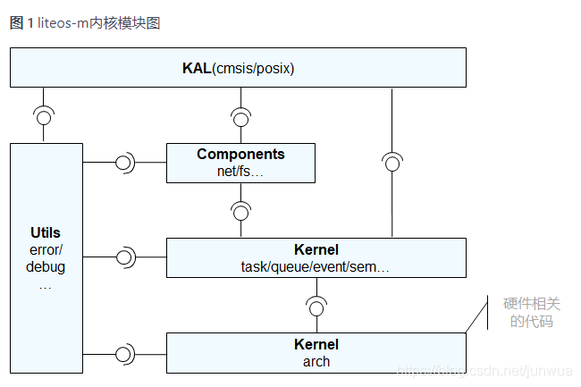
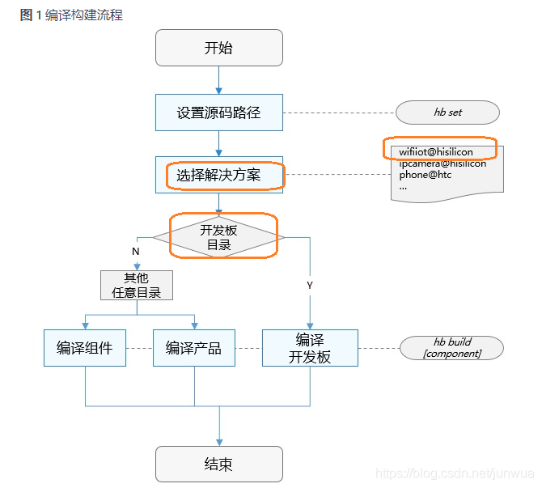

# 系统概述

​      需要明确一个大的前提，不管是kernel，lite os-a，还是lite os-m，在鸿蒙系统中的分层层次地位，他是最底层，最低层，也就说这规范了他的功能和能力范围，对于这两个小的系统来说，基本上也没有什么东西，只是鼓吹了软总线的概念。和其他任何os的功能无本质差异。简单的说这个os的移植实际上对于开发者来说无意义。只有他的服务层和业务能力层才能体现鸿蒙的特性。华为总是不提本质，只说几十KB内存大小，有些回避的意思。

   以下这些资料也只是网上的说法，最终还是要看具体的代码，技术一旦被吹，就很难着地。很多东西也不正确，或者说只是一些提法，但未必能实现。 LiteOS-M内核代码本质上是套娃操作，里面用的还是之前旧的系统，本来就是个小系统。

OpenHarmony LiteOS-M内核是面向IoT领域构建的轻量级物联网操作系统内核，具有小体积、低功耗、高性能的特点，其代码结构简单，主要包括内核最小功能集、内核抽象层、可选组件以及工程目录等，分为硬件相关层以及硬件无关层，硬件相关层提供统一的HAL（Hardware Abstraction Layer）接口，提升硬件易适配性，不同编译工具链和芯片架构的组合分类，满足AIoT类型丰富的硬件和编译工具链的拓展。其架构图如图1所示：

# OpenHarmony LiteOS-M核内核架构图

liteos-m中主要分为KAL、Components、Kernel和Utils四个模块。

- KAL模块作为内核对外的接口依赖Components模块和Kernel模块。

- Components模块可插拔，它依赖Kernel模块。

- 在Kernel模块中，其中硬件相关的代码放在kernel的arch目录中，其余为硬件无关的代码。内核功能集（task、sem等）的实现依赖硬件相关的arch代码，例如任务上下文切换、原子操作等。

- Utils模块作为基础代码块，被其他模块依赖。

 OpenHarmony LiteOS-M内核的编译构建系统是一个基于gn和ninja的组件化构建系统，支持按组件配置、裁剪和拼装，按需构建出定制化的产品。编译构建系统的详细信息可以参考轻量和小型系统编译构建指导。

一个基于gn和ninja的构建系统，以支持OpenHarmony组件化开发为目标，提供以下基本功能：

- 支持按组件拼装产品并编译。

- 独立构建芯片解决方案厂商源码。

- 独立构建单个组件。

1. hb set: 设置OpenHarmony源码目录和要编译的产品。
2. hb build: 编译产品、开发板或者组件。编译主要过程如下：
    - 读取编译配置：根据产品选择的开发板，读取开发板config.gni文件内容，主要包括编译工具链、编译链接命令和选项等。
    - 调用gn：调用gn gen命令，读取产品配置生成产品解决方案out目录和ninja文件。
    - 调用ninja：调用ninja -C out/board/product启动编译。
    - 系统镜像打包：将组件编译产物打包，设置文件属性和权限，制作文件系统镜像。

# 组件、芯片解决方案和产品解决方案配置规则

为了实现芯片解决方案、产品解决方案与OpenHarmony是解耦的、可插拔的，组件、芯片解决方案和产品解决方案的路径、目录树和配置需遵循一定的规则，具体如下：

- 组件

组件源码路径命名规则为：{领域}/{子系统}/{组件}，组件目录树规则如下：

- 芯片解决方案

芯片解决方案是指基于某款开发板的完整解决方案，包含驱动、设备侧接口适配、开发板sdk等。芯片解决方案是一个特殊的组件，源码路径规则为：device/{芯片解决方案厂商}/{开发板}。芯片解决方案组件会随产品选择的开发板默认编译。芯片解决方案目录树规则如下：

# 板级系统移植

- 移植概述

- 板级驱动适配

- HAL层实现

- 系统组件调用

- 三方组件适配

- XTS认证

[zh-cn/device-dev/porting/移植概述-0.md · OpenHarmony/docs - Gitee.com](https://gitee.com/openharmony/docs/blob/master/zh-cn/device-dev/porting/%E7%A7%BB%E6%A4%8D%E6%A6%82%E8%BF%B0-0.md)

以开发板Nucleo-F767Zi为例，演示如何编译运行OpenHarmony LiteOS-M内核工程。在本地目录，执行下述命令克隆示例代码。

git clone https://gitee.com/harylee/nucleo_f767zi.git
https://gitee.com/openharmony/docs/tree/master

最小系统移植完成后，下一步进行板级系统移植，板级系统移植包含以下几个步骤：

1. 板级驱动适配
2. HAL层实现
3. XTS测试套
4. 业务功能验证

 

# HAL层实现

- UTILS
- IOT外设子系统
- WLAN服务

HAL层主要功能是实现轻OpenHarmony与芯片的解耦，以下模块描述的是轻OpenHarmony系统对芯片接口的依赖情况。

git@gitee.com:openharmony/docs.git
[zh-cn/device-dev/porting · OpenHarmony/docs - 码云 - 开源中国 (gitee.com)](https://gitee.com/openharmony/docs/tree/master/zh-cn/device-dev/porting)
OpenHarmony文档仓库  [docs: OpenHarmony documentation | OpenHarmony开发者文档 - Gitee.com](https://gitee.com/openharmony/docs/tree/master/zh-cn/device-dev/porting)

## UTILS

基本介绍：

公共基础提供通用的基础组件，这些基础组件可被各业务子系统及上层应用所使用

## IOT外设子系统

基本介绍

提供轻OpenHarmony专有的外部设备操作接口。本模块提供设备操作接口有：FLASH, GPIO, I2C, PWM, UART, WATCHDOG等。

IOT外设子系统HAL层接口说明:

需要芯片适配相关接口的实现，对芯片设备外设接口依赖请参考IOT外设子系统的HAL头文件。

WLAN服务适用于设备接入WLAN无线局域网场景，包括：

使用STA模式，作为接入方接入其他设备、路由器开启的WLAN无线局域网接入点；

使用AP模式，开启无线局域网接入点，允许其他设备连接。

XTS是OpenHarmony生态认证测试套件的集合，当前包括acts（application compatibility test suite）应用兼容性测试套
